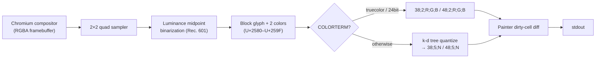

# ADR-005: In-Process Quadrant Renderer over libcaca / aalib

**Status**: Accepted (post-hoc — codifies an existing decision)
**Date**: 2026-05-15
**Deciders**: roctinam
**Supersedes**: None
**Related**: ADR-002 (pyte virtual terminal for screen parsing)

## Context

Carbonyl is a Chromium-based browser whose final compositor output is a pixel framebuffer. To render that framebuffer in a terminal, every pixel must be projected onto a grid of fixed-width character cells. Three families of approaches exist:

1. **libcaca / aalib** — link an external ASCII/color-ASCII art library, hand it a bitmap, let it produce a character grid.
2. **External terminal image protocols** — Sixel, Kitty, iTerm2 inline images. Send the raw bitmap; let the terminal render it.
3. **In-process Unicode block rendering** — convert pixels to Unicode block-element characters (U+2580–U+259F) with ANSI color escapes directly from our own code.

The chosen approach is option 3, implemented in `carbonyl/src/output/`. This ADR records why.

## Decision

Carbonyl renders to the terminal using its own in-process renderer that:

- Maps every **2×2 block of framebuffer pixels** to **one terminal cell** using Unicode quadrant block characters (`▄ ▖ ▗ ▝ ▞ ▐ ▘ ▌ ▚` and full/empty variants in the U+2580–U+259F range).
- For each 2×2 quad, computes per-pixel luminance with the Rec. 601 coefficients (0.299/0.587/0.114), then binarizes against the per-quad midpoint to assign each pixel to one of two color groups. The matching block glyph and two averaged colors are emitted (see `src/output/quad.rs`).
- Emits 24-bit truecolor ANSI escapes (`\x1b[38;2;R;G;B m` / `\x1b[48;2;…m`) when `COLORTERM=truecolor` or `24bit`, falling back to the 256-color xterm palette (`\x1b[38;5;N m`) otherwise. Palette mapping uses a k-d tree quantizer (`src/output/quantizer.rs`, `src/output/kd_tree.rs`).
- Tracks the previously-emitted fg/bg state and skips redundant escapes (`src/output/painter.rs`).

No `libcaca`, `aalib`, Sixel encoder, or Kitty-protocol encoder is linked or invoked.

## Reasoning

1. **Problem analysis**: We need to turn a Chromium-rendered RGBA framebuffer into something a stock VT100-family terminal can display, at interactive frame rates, with reasonable visual fidelity for web content.
2. **Constraint identification**:
   - Must work in any terminal that supports ANSI truecolor or 256-color — i.e. essentially every modern terminal emulator. Sixel/Kitty/iTerm2 protocols are not universally supported.
   - Must be embeddable inside the Chromium build — adding a C dependency (libcaca/aalib) means another vendored third-party tree, another set of CVE exposure, and another build-system entry point.
   - Must produce dense enough output that pages are legible — straight ASCII-art (one ASCII glyph ≈ one pixel) is far too coarse.
   - Output must be selectable text where possible, so terminal copy-paste of page text remains useful (ADR-002 documents pyte's role in extracting that text).
3. **Alternative consideration**:
   - **libcaca**: a mature C library with dithering, multiple character sets, and color quantization. Rejected because (a) its character-set choices and dithering can't easily be tuned to match Chromium's compositor output expectations, (b) it adds a non-trivial C dependency to a project that is already a Chromium fork, and (c) it does not natively understand the half-block / quadrant density we want.
   - **aalib**: monochrome ASCII art only. Density and color fidelity insufficient for browser content.
   - **Sixel / Kitty / iTerm2 inline images**: best visual fidelity, but terminal coverage is poor. Would force a fallback renderer anyway, doubling implementation cost.
   - **Half-block only (U+2580 ▀ / U+2584 ▄)**: maps 2 vertical pixels per cell with 2 colors. Simpler but half the vertical density of quadrants, and noticeably worse on rendered text.
   - **In-process quadrant renderer (chosen)**: 4 pixels per cell, 2 colors per cell, ~2× the effective resolution of half-block at the cost of more glyph-selection logic. No external dependencies. Tunable to our exact pipeline.
4. **Decision rationale**: The quadrant renderer maximises pixel density per terminal cell achievable in pure Unicode + ANSI, has zero external dependencies, and gives us full control over color quantization and dirty-cell tracking. Universally compatible with truecolor and 256-color terminals.
5. **Risk assessment**:
   - The two-colors-per-cell constraint is lossy on high-frequency content (small text, fine gradients). Mitigated by the luminance-midpoint binarization, which preserves contrast edges, and by the 2×2 density.
   - 256-color terminals see additional palette banding from k-d-tree quantization. Acceptable — these terminals are a fallback, not the target.
   - Reimplementing what a library already does carries maintenance cost. Mitigated by the renderer being small (`src/output/` is ~1000 lines total) and tightly scoped to our pipeline.

## Consequences

**Positive**:
- No third-party C dependency for terminal rendering.
- Works on essentially every ANSI-capable terminal without per-terminal capability negotiation.
- Full control over the dirty-cell / cursor-state diffing in `painter.rs`, which is hot-path for frame throughput.
- The whole renderer is ~1000 lines of Rust, readable and modifiable in-tree.

**Negative**:
- Visual fidelity is bounded by 2 colors per 2×2 cell. Image-heavy pages (photos, video) look mosaic-like compared to Sixel/Kitty.
- We carry the color-quantization code ourselves (`quantizer.rs`, `kd_tree.rs`).
- The quadrant glyphs render unevenly across fonts — some monospace fonts have visible gaps between adjacent block characters. Out of scope to fix here; users with affected fonts see a grid pattern.

**Neutral**:
- ADR-002 (pyte) extracts plain text from the rendered cells so accessibility/screen-reader/text-extraction workflows aren't tied to the block glyphs. The renderer and the text-extraction layer are decoupled.

## Diagrams

### Pixel-to-cell mapping



### Quadrant glyph selection (excerpt from `quad.rs`)

```mermaid
flowchart TD
    Q["2×2 quad (x,y,z,w)"] --> L[Compute luma per pixel]
    L --> M[mid = (min+max)/2]
    M --> N["Binarize → 4-bit mask"]
    N --> P0["0000 / 0011 / 1100 / 1111 → ▄"]
    N --> P1["0101 → ▞"]
    N --> P2["0110 → ▐"]
    N --> P3["1001 → ▌"]
    N --> P4["1010 → ▚"]
    N --> P5["others → corner glyphs ▖ ▗ ▘ ▝"]
```

## References

- @$AIWG_ROOT/carbonyl/src/output/quad.rs — quadrant glyph and color binarization
- @$AIWG_ROOT/carbonyl/src/output/painter.rs — ANSI emission, truecolor / 256-color paths, dirty-cell diffing
- @$AIWG_ROOT/carbonyl/src/output/quantizer.rs — 256-color palette construction
- @$AIWG_ROOT/carbonyl/src/output/kd_tree.rs — nearest-color lookup for the quantizer
- @$AIWG_ROOT/carbonyl/src/output/renderer.rs — frame assembly
- @.aiwg/architecture/adr-002.md — pyte virtual terminal for text extraction (sibling decision)
- Unicode block elements: U+2580–U+259F (https://en.wikipedia.org/wiki/Block_Elements)
- ITU-R BT.601 luminance coefficients
- libcaca project (rejected): http://caca.zoy.org/wiki/libcaca
