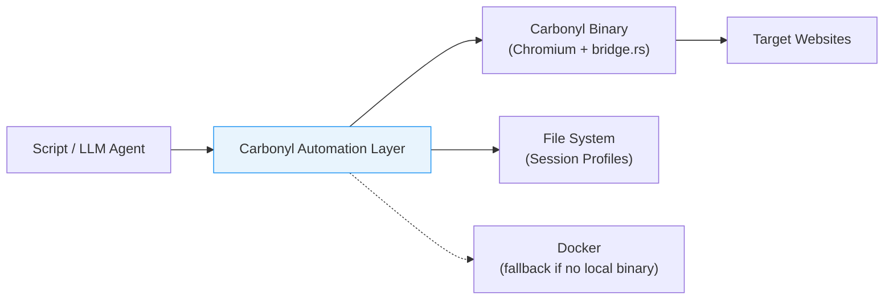
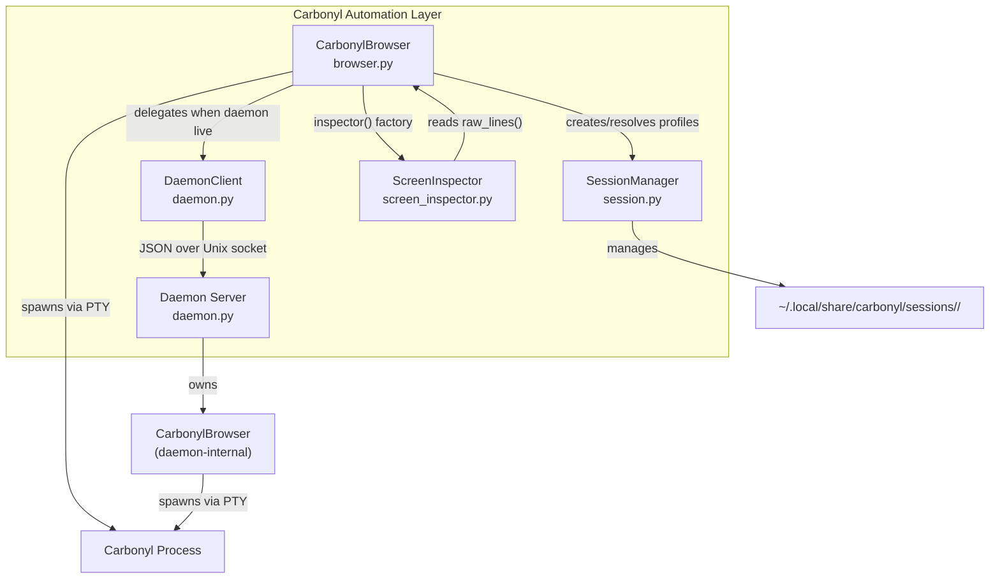

# Software Architecture Document: Carbonyl Automation Layer

## 1. Document Control

| Field | Value |
|-------|-------|
| Version | 1.1 |
| Status | BASELINED |
| Date | 2026-04-03 |
| Scope | `automation/` module (4 Python files, ~1,720 LoC) |

**Revision History:**

| Version | Date | Author | Description |
|---------|------|--------|-------------|
| 1.0 | 2026-04-02 | architecture-documenter | Initial draft |
| 1.1 | 2026-04-03 | documentation-synthesizer | Incorporated security, testability, and traceability review feedback; BASELINED |

---

## 2. Introduction

### 2.1 Purpose

This document describes the software architecture of the Carbonyl Automation Layer, a Python library that enables programmatic web interaction through Carbonyl -- a terminal-based browser built on headless Chromium. The layer was built to support automated web scraping and testing workflows that must bypass commercial bot-detection systems (Akamai Bot Manager, etc.) while maintaining persistent browser sessions.

### 2.2 Scope

The automation layer comprises four modules under `automation/`:

| Module | File | Responsibility |
|--------|------|----------------|
| **CarbonylBrowser** | `browser.py` | Core browser interaction (PTY spawn, screen buffer, input events) |
| **Daemon** | `daemon.py` | Persistent browser server over Unix socket (daemon lifecycle, wire protocol, client proxy) |
| **SessionManager** | `session.py` | Named Chromium profile management (create, fork, snapshot, restore) |
| **ScreenInspector** | `screen_inspector.py` | Screen buffer analysis, coordinate visualization, element detection |

### 2.3 Definitions

| Term | Definition |
|------|------------|
| **Carbonyl** | Terminal browser that renders web pages as text/block characters via a Chromium backend |
| **pyte** | Python terminal emulator library used to maintain the screen buffer |
| **SGR mouse protocol** | Terminal escape sequence format (`\x1b[<Cb;Cx;CyM`) for mouse events |
| **Session** | A named Chromium `--user-data-dir` profile preserving cookies, localStorage, IndexedDB |
| **Drain** | Reading PTY output for a fixed duration to let the screen buffer converge |

---

## 3. Architectural Goals and Constraints

### 3.1 Quality Attributes

**Bot-detection bypass (primary driver):** The system must pass server-side bot classification (Akamai, Cloudflare) by eliminating Chromium fingerprints at the UA string, HTTP/2 SETTINGS frame, `navigator.webdriver`, and mouse-movement entropy layers.

**Session persistence:** Browser state (cookies, localStorage, IndexedDB) must survive process restarts. Multiple independent sessions must coexist without interference.

**Agent compatibility:** The API must be consumable by LLM-based agents that operate on text coordinates, not pixel positions. All coordinates are 1-indexed to match terminal convention.

**Simplicity:** Four modules, no framework dependencies beyond pyte and pexpect. The entire layer runs as a single-user local tool, not a multi-tenant service.

### 3.2 Constraints

| Constraint | Impact |
|------------|--------|
| Carbonyl renders to a fixed terminal grid (220 cols x 50 rows) | All interaction is character-cell-based, not pixel-based |
| pyte is single-threaded | Screen buffer updates happen synchronously during `drain()` |
| Chromium SingletonLock prevents concurrent profile use | Sessions cannot be shared between simultaneous browser instances |
| JA3 TLS fingerprint remains Chromium-native | Full bot evasion requires an external TLS proxy (out of scope) |
| Local-only execution | No network API; daemon communicates over Unix domain socket |

---

## 4. System Context



**External interfaces:**

| Interface | Direction | Mechanism |
|-----------|-----------|-----------|
| Calling script / agent | Inbound | Python API (`CarbonylBrowser` class) |
| Carbonyl binary | Outbound | PTY (pexpect spawn) or Unix socket (daemon mode) |
| Target websites | Outbound (via Carbonyl) | HTTP/1.1 with spoofed Firefox UA |
| Session store | Bidirectional | File system (`~/.local/share/carbonyl/sessions/`) |
| Docker runtime | Outbound (fallback) | `docker run fathyb/carbonyl` |

---

## 5. Component Architecture



### 5.1 CarbonylBrowser

The central interaction class. Operates in two mutually exclusive modes:

**Direct mode:** Spawns Carbonyl via `pexpect.spawn()` over a PTY. Input events are written as raw bytes (keystrokes) or SGR escape sequences (mouse). Output is fed through `pyte.ByteStream` into a `pyte.Screen(220, 50)` buffer. The `drain(seconds)` method reads the PTY in a polling loop for the specified duration to let the screen converge.

**Daemon mode:** When `open()` detects a live daemon for the named session (via `is_daemon_live()`), it instantiates a `DaemonClient` instead. Every subsequent method call (`click`, `send`, `drain`, `find_text`, etc.) is forwarded over the Unix socket. The browser process and screen buffer live in the daemon; the client is stateless.

Mode selection is automatic and transparent to callers. The `if self._daemon_client:` guard at the top of each method is the dispatch mechanism.

### 5.2 Daemon Server and DaemonClient

The daemon keeps a `CarbonylBrowser` alive across client connections. Architecture:

- **Process model:** `start_daemon()` calls `os.fork()` then `os.setsid()` to create a proper daemon. The parent waits up to 5 seconds for the socket to become connectable.
- **Server:** `_BrowserServer` extends `socketserver.ThreadingUnixStreamServer`. Each client connection is handled by `_BrowserHandler` on a daemon thread.
- **Wire protocol:** Newline-delimited JSON. Request: `{"cmd": "...", ...args}`. Response: `{"ok": true, "result": ...}` or `{"ok": false, "error": "..."}`.
- **Shutdown:** The `close` command sets `server.shutdown_requested = True`. A watcher thread polls this flag every 500ms and calls `server.shutdown()`.
- **Socket path:** `~/.local/share/carbonyl/sessions/<name>.sock`.

`DaemonClient` mirrors the `CarbonylBrowser` API method-for-method. Each method is a single `_rpc()` call. Timeout handling extends the socket timeout for `drain` commands by `drain_seconds + 10`.

### 5.3 SessionManager

Manages named Chromium profiles on the file system.

**Storage layout:**
```
~/.local/share/carbonyl/sessions/
  <name>/
    session.json    # SessionMeta (id, name, created_at, tags, forked_from, snapshot_of)
    profile/        # Chromium --user-data-dir
  <name>.sock       # daemon Unix socket (when running)
  <name>--snap--<tag>/  # snapshot (structurally identical to a session)
```

**Key operations:**

| Operation | Behavior |
|-----------|----------|
| `create(name)` | Creates empty profile dir + metadata JSON |
| `fork(src, dst)` | `shutil.copytree` of profile; cleans SingletonLock in copy; records `forked_from` |
| `snapshot(name, tag)` | Fork to `<name>--snap--<tag>`, sets `snapshot_of` in metadata |
| `restore(name, tag)` | Replaces profile dir with snapshot copy; refuses if either is live |
| `clean_stale_lock(name)` | Reads SingletonLock symlink (`hostname-pid`), removes if PID is dead |
| `is_live(name)` | Checks SingletonLock existence + PID liveness via `os.kill(pid, 0)` |

Session names are validated against `^[a-z0-9][a-z0-9\-]*[a-z0-9]$`.

### 5.4 ScreenInspector

A read-only analysis tool that wraps a `raw_lines()` snapshot. Designed for LLM agent consumption.

**Capabilities:**
- `render_grid(marks, regions, row_range, col_range)` -- column ruler + annotated rows with mark overlay and region brackets
- `annotate(marks, regions, context_rows)` -- per-mark context windows with summary table (agent-friendly)
- `crosshair(col, row, radius)` -- small centered view for confirming click targets
- `dot_map(step_col, step_row)` -- calibration grid for coordinate triangulation
- `summarise_region(...)` -- heuristic detection of checkboxes, input fields, buttons, URLs via regex patterns
- `find(text)` -- substring search returning 1-indexed coordinates

---

## 6. Key Architectural Decisions

| ID | Decision | Rationale | Trade-off |
|----|----------|-----------|-----------|
| AD-01 | Use pyte for screen buffer rather than parsing Carbonyl output directly | Gives a reliable, addressable character grid; handles ANSI escape sequences correctly | Adds a dependency; screen buffer is only updated during explicit `drain()` calls |
| AD-02 | pexpect PTY spawn for direct mode | Provides bidirectional byte-level I/O with the Carbonyl process; handles terminal sizing | Requires `drain()` polling loop; no event-driven notification when page loads |
| AD-03 | Daemon uses `os.fork()` + `os.setsid()` (Unix daemonization) | Simple, no dependency on systemd/supervisord; the daemon is a single-user local tool | Linux/macOS only; no Windows support |
| AD-04 | Newline-delimited JSON wire protocol | Human-readable, trivial to implement, debuggable via `socat` | No streaming; entire response must fit in memory; no binary framing |
| AD-05 | 1-indexed coordinates throughout | Matches terminal convention (row 1, col 1 = top-left); SGR mouse protocol is 1-indexed | Off-by-one risk when interfacing with 0-indexed APIs |
| AD-06 | Transparent daemon/direct mode switching | Callers do not need to know whether a daemon is running; `open()` auto-detects | Dual code paths in every method (`if self._daemon_client:` guard) |

---

## 7. Data Architecture

### 7.1 Coordinate System

```
Terminal origin: (col=1, row=1) = top-left character cell
Screen dimensions: 220 columns x 50 rows

Row 1: Carbonyl address bar (nav controls at cols 1-8, URL field at col 12+)
Row 2+: Page content rendered as text + Unicode block characters

SGR mouse escape format: \x1b[<Cb;Cx;CyM
  Cb=0:  left-click press (M) / release (m)
  Cb=32: mouse-move (no button, triggers DOM mousemove via bridge.rs)
  Cx, Cy: 1-indexed column and row
```

### 7.2 Screen Buffer Model

The pyte `Screen(220, 50)` maintains a sparse `buffer` dict keyed by 0-indexed row. Each row is a dict of column index to `Char` (data + attributes). Two text extraction paths exist:

- `extract_text()` -- filters out Unicode block/box-drawing characters (U+2500-U+259F, U+25A0-U+25FF), collapses whitespace, deduplicates consecutive identical lines. Used by `page_text()`.
- `raw_lines()` -- returns unfiltered row text. Used by `find_text()`, `ScreenInspector`, and coordinate-based operations.

### 7.3 Session Data

Session metadata is a JSON sidecar (`session.json`) with fields: `id`, `name`, `created_at`, `tags`, `forked_from`, `snapshot_of`. The daemon extends this at runtime with `daemon_pid` and `daemon_socket`. The Chromium profile directory contains standard `--user-data-dir` contents (cookies, localStorage, IndexedDB, cache).

---

## 8. Security Architecture

### 8.1 Bot-Detection Bypass Stack

The system implements a layered bypass strategy targeting Akamai Bot Manager and similar server-side classifiers:

| Layer | Technique | Chromium Flag / Mechanism | Signal Removed |
|-------|-----------|---------------------------|----------------|
| 1 | UA spoofing | `--user-agent=Mozilla/5.0 (X11; Linux x86_64; rv:122.0) Gecko/20100101 Firefox/122.0` | Chrome/Carbonyl UA string in HTTP headers and `navigator.userAgent` |
| 2 | HTTP/2 fingerprint removal | `--disable-http2` | Chromium-specific HTTP/2 SETTINGS frame (window sizes, max streams, header table size) |
| 3 | WebDriver flag suppression | `--disable-blink-features=AutomationControlled` | `navigator.webdriver=true` detection by client-side JS |
| 4 | Mouse movement entropy | `mouse_move()` / `mouse_path()` via SGR button-32 | Lack of DOM `mousemove` events (bot behavioral signal) |

**Known gap:** JA3/JA4 TLS fingerprint remains Chromium-native. Full evasion requires an external TLS-terminating proxy (e.g., curl-impersonate or a custom mitmproxy plugin). This is out of scope for the automation layer.

### 8.2 Credential and Process Model

- No credentials are stored by the automation layer itself. Session cookies and site credentials persist in the Chromium profile directory under standard Chromium encryption (basic password store / mock keychain via `--password-store=basic --use-mock-keychain`).
- The daemon runs as the invoking user. The Unix socket has default file permissions (no explicit ACL).
- Carbonyl runs with `--no-sandbox` (required for non-root PTY operation). This disables Chromium's sandbox; the browser process has full user-level access.
- **MFA code delivery (R-003):** Downstream automation scripts that deliver MFA codes via a temporary file must not use world-writable paths such as `/tmp`. The MFA code file represents a direct authentication-bypass vector if readable by other local users. See Section 8.3 for the prescribed mitigation.

**File permission requirements:**

| Path | Required Mode | Enforcement Point |
|------|---------------|-------------------|
| `~/.local/share/carbonyl/sessions/<name>/` | `0o700` | `SessionManager.create()` via `os.makedirs(path, mode=0o700)` |
| `~/.local/share/carbonyl/sessions/<name>/session.json` | `0o600` | `SessionManager.create()` via `os.chmod()` after write |
| `~/.local/share/carbonyl/sessions/<name>.sock` | `0o600` | `_BrowserServer` via `os.chmod(socket_path, 0o600)` after bind |
| MFA code file (if used) | `0o600` | Calling script; must use a user-private directory, not `/tmp` |

### 8.3 Security Controls

The following prescribe target-state mitigations for risks identified in the risk register. These are architectural requirements, not descriptions of current behavior.

**R-001 — Plaintext credentials in Chromium profile:**
Chromium stores cookies, localStorage, and cached credentials in its `--user-data-dir` with no application-layer encryption beyond `--password-store=basic`. Mitigation: enforce directory mode `0o700` on all profile directories (see Section 8.2 permission table) so that only the owning user can read profile contents. The `SessionManager.create()`, `fork()`, and `restore()` methods must call `os.chmod()` to enforce this invariant after any directory creation or copy operation.

**R-003 — MFA codes delivered via /tmp:**
Writing MFA codes to a world-writable directory allows any local user to read (and race) the code. Mitigation: MFA code files must be written to a user-private directory (e.g., `~/.local/share/carbonyl/mfa/`) with mode `0o600`. The automation layer does not generate MFA codes itself, but downstream scripts that integrate MFA delivery must adhere to this constraint. The session directory's permission enforcement (R-001) provides the model.

**R-005 — Unauthenticated daemon socket:**
The daemon accepts arbitrary JSON commands over its Unix socket. Any local process that can connect to the socket can navigate to authenticated sites, exfiltrate page content, inject keystrokes, or trigger credential entry. Mitigation (two layers):
1. **Socket file permissions:** `_BrowserServer` must call `os.chmod(socket_path, 0o600)` immediately after `server_bind()`, restricting socket access to the owning user.
2. **Peer credential validation:** On each accepted connection, the handler should validate the peer UID via `SO_PEERCRED` and reject connections from UIDs other than the daemon's own `os.getuid()`. This prevents access even if file permissions are bypassed (e.g., root, or a race during socket creation).

**R-011 — Chromium running with --no-sandbox:**
The `--no-sandbox` flag disables Chromium's multi-process sandbox, meaning any renderer exploit grants full user-level access. Combined with the frozen upstream Chromium version, this creates compounding risk: known Chromium CVEs have no sandbox containment. Mitigation: when the automation layer is used in production-facing contexts, it should run inside a container boundary (Docker, Podman, or equivalent) with a restrictive seccomp profile. The existing Docker fallback path (Section 9.2) provides this boundary; direct-mode execution on a shared host should be documented as accepting this risk.

### 8.4 Daemon Socket Threat Model

The daemon's Unix socket (`~/.local/share/carbonyl/sessions/<name>.sock`) is the primary local attack surface. An attacker with socket access can:

- **Navigate:** Send `{"cmd": "go", "url": "..."}` to direct the browser to any URL, including internal services or `file://` paths.
- **Exfiltrate:** Send `{"cmd": "page_text"}` or `{"cmd": "raw_lines"}` to read the current page content, which may include authenticated session data.
- **Inject input:** Send `{"cmd": "send", "keys": "..."}` or `{"cmd": "click", ...}` to type into form fields (including password fields) or click submit buttons.
- **Terminate:** Send `{"cmd": "close"}` to shut down the daemon and disrupt active automation.

The socket permission enforcement (R-005, Section 8.3) is the primary control. The `SO_PEERCRED` UID check is the secondary control. Together, these restrict socket access to the same user who started the daemon.

---

## 9. Deployment Architecture

The automation layer is a local library, not a deployed service.

### 9.1 Runtime Prerequisites

| Dependency | Source | Purpose |
|------------|--------|---------|
| Python 3.11+ | System | Runtime |
| pexpect | pip | PTY spawn and I/O |
| pyte | pip | Terminal emulator (screen buffer) |
| Carbonyl binary | `build/pre-built/<triple>/carbonyl` or Docker | Browser engine |
| Docker (optional) | System | Fallback if no local binary |

### 9.2 Binary Resolution

`_local_binary()` runs `scripts/platform-triple.sh` to determine the host triple (e.g., `x86_64-unknown-linux-gnu`), then checks `build/pre-built/<triple>/carbonyl`. If the binary is missing or not executable, falls back to `docker run fathyb/carbonyl`. The Docker path mounts the session profile as a volume at `/data/profile`.

### 9.3 Process Topology

**Direct mode:**
```
Script process
  └── pexpect.spawn(carbonyl)  [child process, PTY-connected]
       └── Chromium renderer processes (spawned by Carbonyl)
```

**Daemon mode:**
```
Daemon process (forked, setsid)
  ├── ThreadingUnixStreamServer (main thread, blocks on accept)
  ├── _BrowserHandler threads (one per client connection)
  ├── Shutdown watcher thread
  └── pexpect.spawn(carbonyl) [child process, PTY-connected]
       └── Chromium renderer processes

Client process
  └── DaemonClient (Unix socket connection)
```

---

## 10. Cross-Cutting Concerns

### 10.1 Logging

All log output goes to stderr via the `log()` function in `browser.py`: `[carbonyl] <message>`. There is no structured logging, log levels, or log rotation. The daemon redirects its own stdio to `/dev/null` after fork, so daemon-phase logs are lost unless captured before the redirect.

### 10.2 Error Handling

- Daemon RPC errors return `{"ok": false, "error": "..."}`. The `DaemonClient._rpc()` method raises `RuntimeError` on error responses or connection loss.
- `pexpect.EOF` during `drain()` silently breaks the read loop (browser crashed or closed).
- Session operations raise `KeyError` (not found), `FileExistsError` (already exists), `RuntimeError` (live lock), or `ValueError` (invalid slug).
- No retry logic exists anywhere in the stack. Callers are responsible for retry/recovery.

### 10.3 Concurrency

The daemon uses `ThreadingUnixStreamServer` but the underlying `CarbonylBrowser` is not thread-safe. Concurrent client commands to the same daemon will interleave PTY writes without synchronization. In practice, single-client usage is assumed.

### 10.4 Platform Compatibility

- **Linux:** Primary target. PTY, `os.fork()`, `os.setsid()`, Unix sockets all work.
- **macOS:** Should work (same POSIX primitives). Untested.
- **Windows:** Not supported (no `fork`, no Unix sockets, no PTY in the required form).

### 10.5 Testability

**PTY injection seam:** `CarbonylBrowser` in direct mode is tightly coupled to a live PTY and running Carbonyl process. There is no seam to inject a fake PTY or a pre-populated `pyte.Screen`, making unit coverage of `drain()`, `find_text()`, `raw_lines()`, and input dispatch methods dependent on integration infrastructure. An architectural requirement for construction is to introduce a constructor or factory that accepts a pre-populated `pyte.Screen` object, enabling unit tests for coordinate extraction and screen analysis without a live process.

**Daemon reconnect integration scenario:** The daemon reconnect path -- where a client discovers a crashed daemon (UC-004 Extension E1) and must handle `ConnectionRefusedError` or stale socket files -- is an explicitly required integration test scenario. The socket-based architecture supports this: a test can stand up `_BrowserServer` against a minimal stub and exercise reconnect, socket cleanup, and RPC error propagation without a real Chromium process.

**Three-way dispatch symmetry (architectural constraint):** Every public method on `CarbonylBrowser` must have a corresponding implementation in `DaemonClient._rpc()` dispatch and `_BrowserHandler` server dispatch. This three-way symmetry is an architectural invariant (AD-06). Any new method that omits its daemon counterpart will break daemon-mode callers silently at runtime. Construction must enforce this via a CI test gate that exercises every public method in both direct and daemon modes.

**Bot-bypass verification (accepted limitation):** UC-005 (bypass Akamai Bot Manager) and the mouse-path entropy requirement cannot be verified by unit or integration tests against a controllable server. Bot-detection bypass is inherently an adversarial, end-to-end property that depends on the target site's classifier behavior. This is accepted as an automated testing limitation; validation relies on manual exercise against target sites and regression detection via production automation script failures.

---

## 11. Known Gaps and Future Work

| Gap | Severity | Description |
|-----|----------|-------------|
| JA3 TLS fingerprint | HIGH | Chromium's TLS handshake is detectable. Requires external TLS proxy for sites with JA3-based blocking. |
| No thread safety in daemon | MEDIUM | Concurrent clients to the same daemon can corrupt state. Needs a command queue or lock around browser operations. |
| Daemon logs lost after fork (NFR-014) | LOW | Daemon redirects stdio to `/dev/null` post-fork. **Architectural decision:** daemon stdio shall be redirected to `~/.local/share/carbonyl/sessions/<name>.log` at fork time instead of `/dev/null`, preserving diagnostic output for post-mortem analysis. Implementation deferred to construction iteration 2. |
| No page-load detection | MEDIUM | `drain(seconds)` is a fixed-duration wait. No mechanism to detect when a page has finished loading (e.g., watching for screen buffer stability). |
| No screenshot/DOM export | LOW | The automation layer operates on character-cell text only. No pixel-level screenshot or DOM tree access. |
| Docker fallback ignores headless flags | LOW | Docker path strips `_HEADLESS_FLAGS` assuming they are baked into the image, which may not hold for custom images. |
| SingletonLock race condition | LOW | `clean_stale_lock()` + `open()` is not atomic. A narrow race exists if two processes attempt to claim the same session simultaneously. |
| `disconnect()` flush guarantee (UC-004 / OQ-002) | MEDIUM | The SAD does not define whether `disconnect()` guarantees a Chromium profile flush before returning. **Architectural decision:** `disconnect()` is a socket-close operation only; it does not guarantee profile flush. Callers requiring flush semantics must invoke `drain()` before `disconnect()` to allow pending writes to settle. This is an explicit design choice: the daemon cannot force Chromium to fsync its profile directory, so a guarantee would be misleading. |
