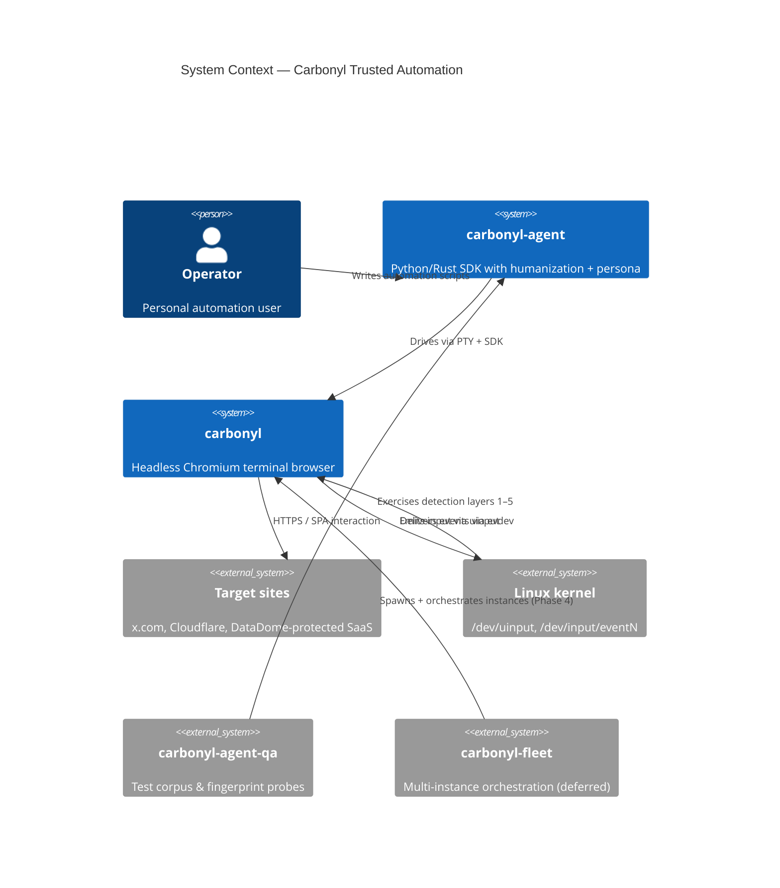
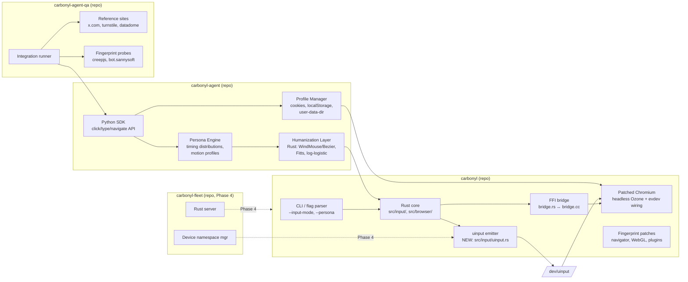
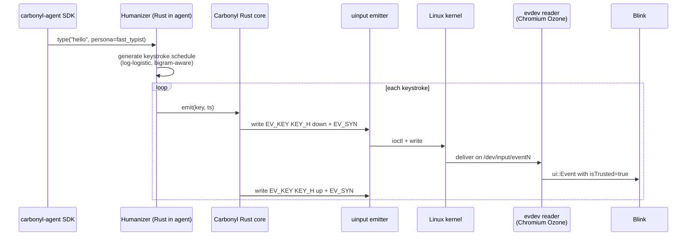
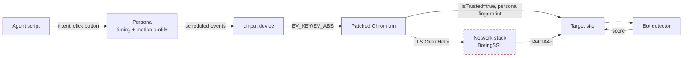

# Architecture — Trusted Automation

## 1. Context (C4 Level 1)



## 2. Container (C4 Level 2)



## 3. Component detail — the three critical paths

### 3.1 Trusted input path (FR-1)



The critical architectural change: **Carbonyl's headless Ozone platform currently uses `StubInputController` and calls `ForwardKeyboardEvent()` directly on the RenderWidgetHost, bypassing the Ozone event source entirely**. For `isTrusted` to be `true`, events must flow through the `ui::PlatformEventSource` → `ui::EventFactoryEvdev` pipeline that Chrome OS already uses.

The good news from research track R1: the full `ui/events/ozone/evdev/` subsystem exists in the Carbonyl tree; it is just not compiled or wired into the headless platform (the BUILD.gn deps exclude it). The work is to:

1. Add `//ui/events/ozone:evdev` to headless platform deps
2. Replace `StubInputController` with `InputControllerEvdev` in `OzonePlatformHeadlessImpl::InitializeUI()`
3. Instantiate `DeviceManager` scanning `/dev/input`
4. Keep the existing `OnKeyPressInput`/`OnMouseXxxInput` callbacks available as a fallback (`--input-mode=synthetic`) for debugging

Alternative considered: write a new Ozone platform (`ozone_platform_carbonyl`) that merges headless rendering with evdev input. Rejected as higher-cost without offsetting benefit; the headless+evdev combo is the minimal change.

### 3.2 Fingerprint normalization (FR-2)

Implementation lives in three places, prioritised by rebase cost:

| Fingerprint | Fix location | Rationale |
|-------------|--------------|-----------|
| `navigator.webdriver` | CLI flag `--disable-blink-features=AutomationControlled` | Already mitigated via flag; verify default |
| UA string `(Carbonyl)` suffix | Revise patch `0004-Setup-browser-default-settings.patch` | Remove suffix at source; CLI override is defense-in-depth |
| WebGL `UNMASKED_*` | New Chromium patch in `gpu/config/gpu_info_collector.cc` | No runtime flag; must patch |
| `navigator.plugins` | New Chromium patch in `third_party/blink/renderer/modules/plugins/` | Must populate with fake PDF Viewer etc. |
| `Notification.permission` | New Chromium patch in notifications module | Override default `"denied"` to `"default"` |
| Client Hints | Content-script injection from carbonyl-agent | Lower rebase cost, per-persona agility |
| `hardwareConcurrency` etc. | CLI flag + Blink runtime override where available; patch otherwise | Mix |

**Rebase cost discipline**: prefer CLI flags and content-script injection. Only patch Chromium source when no flag or injection path exists. The existing 24-patch burden (see `docs/chromium-upgrade-plan.md`) makes new patches a meaningful tax on every Chromium upgrade.

### 3.3 Humanization (FR-3)

```mermaid
flowchart TB
    subgraph POLICY["carbonyl-agent — Policy layer (Python)"]
        PERSONA_CFG[persona.yaml<br/>fast_typist, cautious, etc.]
        SESSION[Session<br/>persona=X, seed=N]
    end

    subgraph GEN["carbonyl-agent — Generation layer (Rust)"]
        KEYSCHED[Keystroke scheduler<br/>log-logistic mixture<br/>bigram table]
        MOTION[Motion generator<br/>WindMouse or<br/>Bezier + Fitts + overshoot]
        TREMOR[Tremor injector<br/>Gaussian noise]
    end

    subgraph DISPATCH["carbonyl — Dispatch layer (Rust)"]
        QUEUE[Event queue<br/>scheduled at (t, payload)]
        EMIT[uinput emitter]
    end

    PERSONA_CFG --> SESSION
    SESSION --> KEYSCHED
    SESSION --> MOTION
    MOTION --> TREMOR --> QUEUE
    KEYSCHED --> QUEUE
    QUEUE --> EMIT
```

**Repo split rationale** (from research track R3): generation lives in Rust (either carbonyl-agent's Rust crate or carbonyl itself) because it must emit at 60–120 Hz with realistic timing grain. Python-side policy is configured once per session; crossing the IPC boundary per event would introduce jitter that itself looks bot-like.

Whether the humanizer lives in `carbonyl-agent` or `carbonyl` is a trade-off:
- **carbonyl-agent** (recommended): faster iteration, no Chromium rebuild for humanization tweaks, clean separation of "what's a real human" (agent policy) vs "how does one press a key" (carbonyl plumbing)
- **carbonyl**: slightly lower latency (no cross-process IPC); but carbonyl rebuilds are 1–3h

Decision: **humanizer in carbonyl-agent**, emitting scheduled events over the existing PTY + Unix socket. Carbonyl's uinput backend receives pre-timed events and emits them without further scheduling.

## 4. Data flow — detection-layer perspective (DFD)



Green = fully addressed by Phases 1–2. Red dashed = TLS layer, deferred to Phase 3 pending research spike.

## 5. Repo ownership matrix

| Concern | carbonyl | carbonyl-agent | carbonyl-agent-qa | carbonyl-fleet |
|---------|:--------:|:--------------:|:-----------------:|:--------------:|
| Chromium patches (fingerprint + Ozone evdev) | ✓ | | | |
| Rust input loop + uinput emitter | ✓ | | | |
| CLI flags (`--input-mode`, `--uinput-device-name`, `--persona`) | ✓ | | | |
| FFI bridge | ✓ | | | |
| Humanization (keystroke + motion generation) | | ✓ | | |
| Persona engine / profile registry | | ✓ | | |
| Session profile management (cookies, user-data-dir) | | ✓ | | |
| Python SDK surface | | ✓ | | |
| Reference test sites & fingerprint probes | | | ✓ | |
| Integration test runner | | | ✓ | |
| Multi-instance device namespacing | ✓ (primitive) | | | ✓ (orchestration, later) |
| TLS/HTTP2 fingerprint (Phase 3) | ? | ? | | |

## 6. Architectural decision records to produce

Following `docs/adr-001-language-architecture.md` format, the following ADRs should land in `carbonyl/docs/`:

- **ADR-002**: Choose evdev+uinput over CDP-based trusted input
- **ADR-003**: Humanization lives in carbonyl-agent (Rust generation, Python policy)
- **ADR-004**: Fingerprint mitigations prefer CLI flags → content scripts → Chromium patches (in that order)
- **ADR-005** (Phase 3): TLS fingerprint approach (BoringSSL patch vs uTLS proxy intermediary)

## 7. Risks & mitigations

| Risk | Probability | Impact | Mitigation |
|------|-------------|--------|------------|
| Wiring evdev into headless Ozone has Chromium-side complexity we don't foresee (thread coordination between Carbonyl FFI and EventThreadEvdev) | Medium | High | Phase 1 starts with a validation spike (Python uinput + existing Carbonyl) before committing to Chromium patches |
| Chromium upgrade rebases break new patches | High (over time) | Medium | Prefer flags/content-scripts; document every patch in `MAINTENANCE.md`; target rebase-friendliness |
| Detection vendors update scoring faster than we can iterate | High | Medium | QA corpus in carbonyl-agent-qa runs nightly; regression detection catches vendor updates early |
| uinput permissions friction in container/systemd-nspawn deployments | Medium | Low | Documentation + pre-flight `doctor` command in agent SDK |
| TLS fingerprint work balloons into a separate project | High | Low | Scoped as Phase 3 with its own spike; explicit deferrable |
| Humanization parameters tuned to today's detectors become over-fitted | Medium | Medium | Keep parameters data-driven; QA harness measures each layer independently |

## 8. References

- Research R1 (Ozone evdev): summarized in `06-research-index.md`
- Research R2 (fingerprint inventory): ditto
- Research R3 (humanization literature): ditto, with citations
- Research R5 (Carbonyl patch inventory): ditto
- Existing docs: `docs/architecture.md`, `docs/rust-chromium-boundary.md`, `docs/chromium-integration.md`, `docs/chromium-upgrade-plan.md`
