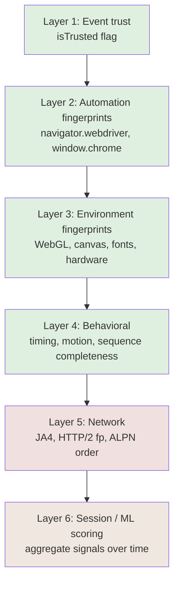

# Threat Model — Carbonyl Trusted Automation

## Framing

Unusual inversion: the "adversary" here is the **bot-detection system**, not a malicious actor attempting to harm users. This threat model enumerates detection signals that distinguish Carbonyl from a human-driven Chrome, treats each as an attack vector on our goal, and maps mitigations.

A parallel standard security threat model (STRIDE on Carbonyl as a deployed service) exists separately and is not in scope here.

## 6-layer detection stack

Green = addressed in Phases 1–2. Light red = Phase 3. Orange = partially addressable (session aging) and partially out-of-scope (IP/ASN reputation).

## Layer 1 — Event trust (`isTrusted`)

### Signal
A single boolean property on every DOM event. Set by Blink based on event provenance: real kernel input device → `true`; `element.dispatchEvent()` → `false`; CDP `Input.dispatchKeyEvent` → `true` (privileged process); direct `ForwardKeyboardEvent` FFI call (Carbonyl today) → `false`.

### Current Carbonyl exposure
100% of events are `isTrusted: false`. React-controlled forms clear on next render, bot libraries refuse to fire handlers, MFA flows fail silently.

### Mitigation
See architecture §3.1. Wire `EventFactoryEvdev` into headless Ozone; events originate from `/dev/input/eventN` reads and carry proper provenance.

### Residual risk
Very low once implemented. `isTrusted` is a binary property; the kernel input pipeline cannot fake provenance to Blink.

### Bypass attempts by detectors
Theoretically, advanced detectors could correlate `isTrusted: true` events with missing corresponding raw-device artefacts (e.g. no `pointerrawupdate` events, no `InputDevice` API surface). Low likelihood; no public evidence of detectors doing this today.

---

## Layer 2 — Automation fingerprints

### Signals

| Signal | Tell |
|--------|------|
| `navigator.webdriver === true` | Direct automation flag, set by `--enable-automation` or `--headless` |
| `window.chrome` undefined | Headless mode omits the `chrome` object that real browsers expose |
| User-Agent contains `HeadlessChrome` or `(Carbonyl)` | Trivial substring match |
| `window.cdc_*` variables | ChromeDriver artefacts; not applicable to Carbonyl but detectors still check |
| `Runtime.enable` CDP traces | Advanced; some fingerprinters probe for CDP |

### Current Carbonyl exposure
- `navigator.webdriver`: mitigated via `--disable-blink-features=AutomationControlled` (applied in `automation/browser.py:48`). Verify this flag is set by default in agent builds.
- UA: `(Carbonyl)` suffix is in patch `0004`. Must be removed for agent-facing builds.
- `window.chrome`: absent. Unpatched.
- CDP: Carbonyl does not expose a debugging port by default; safe.

### Mitigation
- Remove the `(Carbonyl)` UA suffix from patch 0004 or gate it behind a dev-mode flag
- Content-script inject a minimal `window.chrome.runtime` stub from carbonyl-agent pre-navigation
- Keep `--disable-blink-features=AutomationControlled` as the default

### Residual risk
Low. These are static surface checks; any of them can be audited with a single JS snippet against `bot.sannysoft.com`.

---

## Layer 3 — Environment fingerprints

### Signals

| Signal | Tell |
|--------|------|
| `gl.getParameter(UNMASKED_RENDERER_WEBGL)` = `"llvmpipe"` or `"Mesa"` | Headless software rasterizer |
| `navigator.plugins.length === 0` | Real Chrome has at least PDF plugins |
| `navigator.mimeTypes.length === 0` | Same |
| `Notification.permission === "denied"` without prompt | Headless auto-denies |
| Canvas toDataURL hash | Cross-referenced against known headless profiles |
| `screen.width`/`screen.height` = 0 or default | Headless often misreports |
| `hardwareConcurrency`, `deviceMemory` | Stock values differ from real hardware distribution |
| `navigator.userAgentData` reports | Client Hints; Linux + headless visible |
| Font enumeration | Headless has a restricted font set |
| AudioContext fingerprint | Deterministic in headless |

### Current Carbonyl exposure
WebGL reports software stubs (critical). Plugins array empty. Notification.permission auto-denies. Canvas and AudioContext are stock headless Chromium (deterministic across instances).

### Mitigation

- **WebGL**: Chromium patch in `gpu/config/gpu_info_collector.cc` to return a configurable vendor/renderer string. Exposed through a CLI flag or env var.
- **Plugins**: Chromium patch in `third_party/blink/renderer/modules/plugins/` to populate PDF Viewer and Chrome PDF Plugin entries.
- **Notification.permission**: Chromium patch in notifications module to return `"default"` in headless mode.
- **Canvas / AudioContext**: Add small randomized noise per-session via content-script hook, configurable per persona. Trade-off: breaks sites relying on canvas-based rendering checks. Default off; enable per persona.
- **Screen + hardware**: Persona-configured; inject via Blink runtime or content script.
- **Fonts**: Out-of-scope for MVP; mitigation is shipping a richer font set in the Carbonyl base image (ops concern).

### Residual risk
Medium. Canvas and AudioContext fingerprints are a cat-and-mouse game. Randomization breaks the fingerprint but is itself a signal (real browsers are deterministic). Persona-stable randomization per session is the pragmatic compromise.

---

## Layer 4 — Behavioral

### Signals (input side, from R3 research)

- Keystroke timing distribution shape (log-logistic expected; uniform = bot)
- Dwell (keydown→keyup) 50–200 ms, flight 80–400 ms envelopes
- Bigram-specific timing (common pairs faster)
- Two-component mixture: mechanical pauses vs cognitive pauses
- Mouse entropy: direction-change frequency, curvature
- Fitts's law compliance (MT ∝ log(D/W))
- Overshoot + corrective submovement in ~70% of motions
- Minimum-jerk velocity profile (bell-shaped)
- Physiological tremor at low velocities
- Sequence completeness: pointerdown→mousedown→mouseup→click in order
- Preceding `mousemove` before every click
- Focus/blur/visibilitychange events over session lifetime
- Idle-gap distribution (humans pause 2–30 s occasionally)

### Current Carbonyl exposure
Zero humanization. Events arrive at whatever rate the SDK emits, typically perfectly uniform or all-at-once. No mouse-move entropy; clicks without motion. Entire Layer 4 is failing.

### Mitigation
`carbonyl-agent` humanization layer (architecture §3.3). WindMouse or Bézier+Fitts for motion; log-logistic mixture for keystrokes with bigram table; tremor injection at low velocity; forced preceding `mousemove` before every `click(x,y)`; policy-driven idle gaps.

### Residual risk
Medium. Humanization can match published feature distributions, but detectors train on adversarial examples. Replay detection (Akamai) means reusing a scored-as-human `sensor_data` blob fails even with perfect motion. Mitigation is *not* reusing sensor data across sessions and ensuring persona-driven variance.

---

## Layer 5 — Network (TLS + HTTP/2, including coherence with other layers)

### Signals
JA4/JA4+ TLS fingerprint, JA4H (HTTP-layer), HTTP/2 Akamai fingerprint (`S|WU|P|PS` per Black Hat EU 2017), ALPN order, post-quantum key share, HTTP/3 transport parameters, pseudo-header order.

### Current Carbonyl exposure
**Chromium-emitted traffic**: stock BoringSSL JA4, matching real Chrome M147. Drifts behind stable Chrome as Carbonyl lags upstream.

**Agent-side Python egress** (`carbonyl-agent` making its own HTTP requests outside the browser): stock Python `requests`/`httpx` JA4 — distinctively non-browser, trivially fingerprinted as a script.

### Reframed threat

Browser-based automation tools (including Carbonyl) **already emit real-Chrome JA4** because they wrap real Chromium. TLS-impersonation libraries exist to rescue non-browser scrapers; they are not the correct tool for us on Chromium-emitted traffic.

The real Layer 5+ risk is **cross-layer incoherence**: a persona that declares "Chrome 147 on Linux" through its UA/UA-CH but emits stock Chromium-147 JA4 and Python `requests` JA4 from the same session is more suspicious than stock Chromium, because the signals disagree. CreepJS exists specifically to detect this.

### Mitigation (Phase 3, owned fingerprint registry)

See `07-fingerprint-registry-design.md` for the full design.

- **Chromium-emitted traffic**: accept Chromium's stock JA4 as ground truth; personas declare a Chrome version matching the actual Carbonyl build. Refresh corpus when Carbonyl upgrades Chromium.
- **Agent-side egress**: route all agent-initiated HTTP through `wreq` (or fallback `tls-client`) with the matching persona profile. Any library that bypasses this is audited and flagged.
- **Cross-layer coherence**: enforced by the registry's validator. No persona is usable without passing UA↔UA-CH↔JA4↔H2↔WebGL↔fonts consistency checks.
- **Quarterly JA4 drift audit**: CI measures Carbonyl's observed JA4 vs current stable Chrome; flags when drift exceeds tolerance.
- **Phase 3E (deferred sub-phase)**: if drift audit reveals Chromium-version lag is causing real blocks, consider BoringSSL patching to let personas override Chromium's stock JA4. Hard rebase cost; only justified empirically.

### Residual risk
Low-to-medium. Persona-bundle coherence is the actual adversary signal; the registry directly addresses it. Chromium-version drift is a slow-moving concern, audited but not patched unless empirically warranted.

---

## Layer 6 — Session / ML scoring

### Signals
Aggregate scoring across all above signals plus:
- IP reputation (ASN type, prior abuse, geo-timezone consistency)
- Cookie / session age
- Cross-site tracking signals
- Behavioral trajectory over multiple visits

### Current Carbonyl exposure
No session persistence by default. Fresh profile every run = strong bot signal.

### Mitigation (in scope: cookies/profile; out of scope: IP reputation)
- **In scope**: `carbonyl-agent` durable profile directories keyed by persona. Aged profiles (warmed with realistic browsing before sensitive-site access). Per-site cookie jars preserved across sessions.
- **Out of scope**: IP/ASN reputation is a procurement concern. Documented as operator responsibility.

### Residual risk
Moderate. Session persistence mitigates the fresh-profile tell. IP reputation remains operator-controlled.

---

## Non-goals (explicitly)

- **Credential theft / impersonation**: toolchain is for operators driving their own accounts
- **CAPTCHA solving**: we aim to not trigger CAPTCHAs
- **Defeating high-protection-tier Akamai deployments** (banking, airline): requires session-replay resistance and residential-ASN infrastructure beyond our scope
- **Mobile browser impersonation**: desktop Chrome only

## Summary matrix

| Layer | Current status | Phase 1 | Phase 2 | Phase 3 | Residual |
|-------|----------------|---------|---------|---------|----------|
| 1 Event trust | FAILING | FIXED | | | Low |
| 2 Automation fp | PARTIAL | | FIXED | | Low |
| 3 Environment fp | FAILING | | FIXED | | Medium |
| 4 Behavioral | FAILING | | FIXED | | Medium |
| 5 Network | STOCK Chrome | | | FIXED | Low post-Phase 3 |
| 6 Session | FAILING | | PARTIAL | | Moderate (IP scope) |
