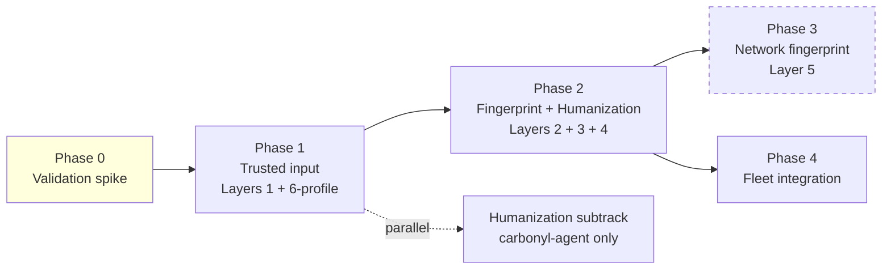

# Phase Gate Plan — Trusted Automation

## Phase model

This initiative is organized as a **flow-gate track** with four phases. Each phase has:
- Explicit entry preconditions (gate open)
- A set of workstreams
- Concrete exit criteria (gate for next phase)
- A validation spike before committing construction work

Effort is expressed in **agent-oriented units** (scope count, agent roles, parallelism map, pass estimate) per the `no-time-estimates` rule. No wall-clock estimates.

## Dependency graph



## Phase 0 — Validation spike (revised 2026-04-19)

**Context**: An earlier revision of this phase asked whether uinput events reach Blink via a Chromium evdev-in-headless-Ozone patch. That question was partly answered on 2026-04-19: a host-side sanity check proved uinput → kernel → X → browser = `isTrusted: true` works with stock Chromium when an X server is in the loop. Combined with the container-deployment requirement to capture visual screenshots alongside Carbonyl's terminal render (which also requires X in the container), the plan pivoted to **Xorg-in-container + Carbonyl `ozone_platform=x11`** (ADR-002 rev 2). The Phase 0 question changed with it.

**New question to answer**: Can Carbonyl build and run with `ozone_platform=x11`, preserving its terminal rendering, when deployed under Xorg-in-container, with uinput-emitted keystrokes arriving at Blink with `isTrusted: true`?

**Workstreams** (status as of 2026-04-20):

0. ✅ **W0.a host-side sanity check** (2026-04-19, grissom): uinput → host Xorg → real browser = `isTrusted: true` end-to-end. Validates the pipeline concept.
1. ✅ **W0.1 patch paper-audit** (`#61` closed 2026-04-20): All 24 Carbonyl patches target `chromium/src/headless/` (the shell) not `ui/ozone/platform/headless/` (the Ozone backend). File-apply risk is 0/24. Semantic risk carries in 5/24 patches (`0003`, `0006`, `0009`, `0013`, `0023`) that hook the rendering bridge — validated at runtime in W0.2. Report: `.aiwg/reports/phase0-w01-patch-audit.md`.
2. **W0.2 Carbonyl x11-Ozone build** (`#57`): change `args.gn` to `ozone_platform="x11"` + `ozone_platform_x11=true`; apply patches (expected clean); rebuild; runtime-validate the 5 yellow patches per the audit's risk register.
3. **W0.3 Container image** (`carbonyl-agent#37`): `carbonyl-agent-qa-runner` Docker image bundles Xorg (`dummy` + `modesetting` drivers installed; operator picks at runtime via `CARBONYL_GPU_MODE`), uinput passthrough, capture tools (`scrot`, `ffmpeg`). Can proceed in parallel with W0.2 using a stand-in Carbonyl.
4. **W0.4 In-container isTrusted re-run** (covered by `carbonyl-agent-qa#1`): reuse the driver + logger fixtures, run inside the container. High-confidence PASS.
5. **W0.5 Capture validation** (covered by `carbonyl-agent-qa#1`): `scrot` / `ffmpeg -f x11grab` from `DISPLAY=:99` produces a non-blank framebuffer while Carbonyl renders.
6. **W0.6 Text-render parity** (`#62`): terminal output from x11-Ozone Carbonyl matches (within fidelity tolerance) the headless-Ozone baseline on 3 reference pages.

**Exit criteria** (gate to Phase 1):
- All five workstreams PASS → ADR-002 approved, Option A confirmed, Phase 1 scope shifts per the new plan
- Build or text-render workstream fails → audit patch compatibility; escalate to patch-revision effort or fall back to ADR-002 Option C (rev-1 plan: patch headless Ozone with evdev)
- isTrusted fails in-container (unusual) → diagnose; likely container-specific, not architectural

**Deliverable**: ADR-002 finalized; Phase 1 issues updated per the container-based path; rendering bridge patch audit report (filed in `.aiwg/reports/`).

## Phase 1 — Trusted input (Layer 1) + session profile (Layer 6 partial) — revised 2026-04-19

**Objective**: X/Twitter login flow advances past username→password→MFA with `carbonyl-agent` driving a containerized Carbonyl (`ozone_platform=x11` under Xorg + uinput).

**Workstreams** (per ADR-002 rev 2; W1.1 and W1.2 are substantially simpler than rev 1):

| ID | Workstream | Repo | Issue | Parallel with |
|----|-----------|------|-------|---------------|
| W1.1 | Carbonyl build variant with `ozone_platform=x11`; patch-compatibility audit for patches 0001–0024 under x11 Ozone | carbonyl | #57 (rescoped) | W1.2, W1.4 |
| W1.2 | Container image (`carbonyl-agent-qa-runner`): Xorg with `dummy` + `modesetting` drivers; uinput passthrough; entrypoint switching on `CARBONYL_GPU_MODE` | carbonyl-agent (or new builder repo) | NEW (replaces #59) | W1.1 |
| W1.3 | carbonyl-agent Python uinput emitter module (wraps `python-uinput`); wired into the SDK's `type()` / `click()` / `mouse_move()` APIs | carbonyl-agent | NEW agent#C-input | depends on W1.2 |
| W1.4 | Durable user-data-dir profile management in agent SDK | carbonyl-agent | #33 (unchanged) | W1.1 (independent) |
| W1.5 | Layer 1 + Layer 6-partial test harness, **run inside the container** | carbonyl-agent-qa | #1 (revised container shape) | anytime |

**Agent roles**:
- W1.1: Chromium C++ / GN developer (patch audit + x11 Ozone build)
- W1.2: Container / Dockerfile author (Xorg + driver packaging + entrypoint)
- W1.3: Python/Rust SDK developer
- W1.4: SDK developer (profile lifecycle)
- W1.5: QA engineer (containerized harness)

**Pass estimate**: W1.1 is the dominant uncertainty — whether existing rendering patches survive the Ozone switch. Rebuild cycle per audit iteration is hours. W1.2–W1.5 are single-pass with review. No Rust uinput crate in Carbonyl itself; input emission lives entirely in carbonyl-agent (Python-first, optional Rust speedup later).

**Exit criteria** (gate to Phase 2):
- FR-1.1 through FR-1.5 pass their acceptance tests (§04 Layer 1) in the container harness
- x.com login flow advances past username step on a warmed profile in the container (manual verification acceptable for gate)
- ADR-003 drafted (humanization location decision) in prep for Phase 2
- Visual capture (`scrot`/`ffmpeg`) works alongside terminal render — documented in a `docs/capture-streaming.md` operator guide

## Phase 2 — Fingerprint normalization + humanization (Layers 2, 3, 4)

Phase 2 runs as **two parallel subtracks** that merge at the exit gate.

### Subtrack A — Fingerprint (Layers 2, 3)

| ID | Workstream | Repo | Issue |
|----|-----------|------|-------|
| W2A.1 | Remove `(Carbonyl)` UA suffix; verify `--disable-blink-features=AutomationControlled` default | carbonyl | NEW carbonyl#B |
| W2A.2 | WebGL vendor/renderer spoof patch | carbonyl | NEW carbonyl#C |
| W2A.3 | `navigator.plugins` populate patch | carbonyl | NEW carbonyl#D |
| W2A.4 | `Notification.permission` default patch | carbonyl | NEW carbonyl#E |
| W2A.5 | Client Hints + `window.chrome.runtime` content-script injector | carbonyl-agent | NEW agent#C |
| W2A.6 | Fingerprint probe test suite | carbonyl-agent-qa | NEW qa#B |

### Subtrack B — Humanization (Layer 4)

| ID | Workstream | Repo | Issue |
|----|-----------|------|-------|
| W2B.1 | Persona config schema + loader | carbonyl-agent | NEW agent#D |
| W2B.2 | Keystroke scheduler (log-logistic + bigram table) | carbonyl-agent | NEW agent#E |
| W2B.3 | Mouse motion generator (WindMouse or Bézier+Fitts+overshoot) | carbonyl-agent | NEW agent#F |
| W2B.4 | Tremor + velocity profile shaping | carbonyl-agent | NEW agent#G |
| W2B.5 | SDK API surface: `click`, `type`, `mouse_path` with `humanize` param | carbonyl-agent | NEW agent#H |
| W2B.6 | Behavioral test harness | carbonyl-agent-qa | NEW qa#C |

**Parallelism**: W2A.* and W2B.* are fully parallel. Within W2A, items .1–.4 are parallel Chromium patches (each its own patch file). Within W2B, .1 blocks .2–.5; .2, .3, .4 run parallel.

**Agent roles**:
- Subtrack A: Chromium C++ developer (×3–4 parallel for patches), SDK integrator for W2A.5, QA for W2A.6
- Subtrack B: Rust systems developer (×2 parallel on keystroke + motion), SDK developer for W2B.5, QA for W2B.6

**Exit criteria** (gate to Phase 3):
- FR-2.* all pass acceptance tests
- FR-3.* all pass statistical acceptance tests (KS test, bigram ratio, overshoot rate, Fitts coefficient)
- creepjs / bot.sannysoft probe results within documented tolerance
- Cloudflare Turnstile passes on ≥90% of 100 fresh sessions in nightly CI

## Phase 3 — Owned fingerprint registry (Layer 5 + cross-layer coherence)

**Reframed** from earlier "deferred TLS impersonation." Per `07-fingerprint-registry-design.md` and research findings R7–R9, the correct primitive is a **persona bundle** — a frozen tuple of every fingerprintable signal, sampled from joint real-traffic distributions, validated for internal consistency, and applied coherently across Chromium and agent-side egress. This is not a proxy bolt-on; it's a first-class component.

**Gate**: Phase 2 complete; ADR-005 authored (library choice: `wreq` primary, `tls-client` fallback); ADR-006 authored if deeper BoringSSL work is warranted.

### Sub-phase 3A — Registry foundation (carbonyl-agent or new crate)

| ID | Workstream | Repo |
|----|-----------|------|
| W3A.1 | `carbonyl-fingerprint` crate foundation: schema + storage + API | carbonyl-agent (or new repo) |
| W3A.2 | Joint-distribution corpus + sampler (BrowserForge integration or port) | carbonyl-agent |
| W3A.3 | Validator — UA↔UA-CH↔JA4↔H2↔WebGL↔fonts consistency rules (see design §5) | carbonyl-agent |
| W3A.4 | Refresh pipeline — detect stable Chrome releases, capture reference fingerprints, update corpus | carbonyl-agent + CI |

### Sub-phase 3B — Agent-side egress fingerprinting

| ID | Workstream | Repo |
|----|-----------|------|
| W3B.1 | `wreq` integration as the default egress HTTP client in carbonyl-agent | carbonyl-agent |
| W3B.2 | Persona → `wreq` profile binding (consume persona.network.*) | carbonyl-agent |
| W3B.3 | Audit + flag any non-wreq HTTP call sites in the SDK | carbonyl-agent |

### Sub-phase 3C — Persona → Chromium applier

| ID | Workstream | Repo |
|----|-----------|------|
| W3C.1 | Persona applier: derive Carbonyl CLI flags + content-script bundle from persona | carbonyl-agent |
| W3C.2 | Rewire Phase 2A fingerprint patches to consume persona values (not hardcoded) | carbonyl + carbonyl-agent |
| W3C.3 | Quarterly Chromium-JA4 drift audit CI job | carbonyl-agent-qa |

### Sub-phase 3D — Validation and QA

| ID | Workstream | Repo |
|----|-----------|------|
| W3D.1 | Per-persona consistency harness: declared vs observed | carbonyl-agent-qa |
| W3D.2 | Nightly observed-fingerprint regression suite | carbonyl-agent-qa |
| W3D.3 | CreepJS + tls.peet.ws + http2.pro probe integration | carbonyl-agent-qa |

### Sub-phase 3E — Deep Chromium control (deferred, trigger-gated)

Only attempted if quarterly drift audit (W3C.3) shows Carbonyl's Chromium-emitted fingerprint is causing real blocks on the target workload AND Phase 3A–3D alone are insufficient.

| ID | Workstream | Repo |
|----|-----------|------|
| W3E.1 | BoringSSL patch for Carbonyl's Chromium: accept persona-declared ClientHello values | carbonyl |
| W3E.2 | H2 SETTINGS/pseudo-header patch in Chromium's HTTP/2 stack | carbonyl |
| W3E.3 | Maintenance discipline: per-Chrome-version patch refresh | carbonyl |

High rebase cost; enter this sub-phase only with explicit ADR and empirical justification.

### Exit criteria (Phase 3 without 3E)

- FR-5.1, FR-5.2 pass against `tls.peet.ws` and `http2.pro` for agent-side egress traffic
- Every supported persona passes consistency validation in CI
- Carbonyl's Chromium-emitted JA4 is measured, logged, and within tolerance of current stable Chrome (or within documented drift)
- Registry auto-refresh demonstrated across at least one Chrome stable release cycle

### Explicit option: stop at Phase 3 without 3E

If Phase 3A–3D deliver passing metrics on the reference corpus, Phase 3E remains deferred. This is a legitimate end state, recorded in ADR-005 with empirical justification.

## Phase 4 — Fleet integration

**Gate**: Phase 1 complete (earliest); concurrent with Phase 2 is acceptable.

**Workstreams** (all in carbonyl-fleet):
- W4.1: Server-side uinput device namespacing (`--uinput-device-name` fed per-instance)
- W4.2: Multi-tenant profile isolation
- W4.3: Per-instance persona assignment
- W4.4: Observability / metrics aggregation across fleet

**Exit criteria**: N=10 concurrent Carbonyl instances on a single host drive independent agent flows without uinput crosstalk; end-to-end test against reference corpus passes per-instance.

## Cross-cutting deliverables

- **ADRs**: 002 (input approach), 003 (humanization location), 004 (fingerprint mitigation priority), 005 (fingerprint registry library choice — wreq primary, tls-client fallback), 006 (conditional: if Phase 3E activated, BoringSSL patch strategy)
- **Docs**: `carbonyl/docs/trusted-automation.md` (public-facing), `carbonyl/docs/uinput-setup.md` (operator guide), `carbonyl-agent/docs/personas.md`
- **Observability**: per-session metric counters (events, humanization profile, fingerprint spoofs active)
- **Security review**: explicit sign-off on uinput permissions model, content-script injection surface, and non-goal boundaries

## Issue map (to be filed in Phase 0 close)

```
roctinam/carbonyl (Gitea)
├─ #57          Trusted input via /dev/uinput  (existing; repurpose as W1.1)
├─ #NEW-A       Rust uinput emitter + CLI flags
├─ #NEW-B       Remove Carbonyl UA suffix + verify automation flag default
├─ #NEW-C       WebGL vendor/renderer spoof patch
├─ #NEW-D       navigator.plugins populate patch
├─ #NEW-E       Notification.permission default patch
└─ #UMBRELLA    Trusted Automation Initiative (this plan)

roctinam/carbonyl-agent (Gitea)
├─ #NEW-A       Backend-switch API (synthetic|uinput)
├─ #NEW-B       Durable user-data-dir profile management
├─ #NEW-C       Client Hints + window.chrome content-script injector
├─ #NEW-D       Persona config schema + loader
├─ #NEW-E       Keystroke scheduler
├─ #NEW-F       Mouse motion generator
├─ #NEW-G       Tremor + velocity shaping
└─ #NEW-H       Humanize API surface

roctinam/carbonyl-agent-qa (Gitea)
├─ #NEW-A       Layer 1 + Layer 6-partial test harness
├─ #NEW-B       Fingerprint probe test suite
└─ #NEW-C       Behavioral test harness

roctinam/carbonyl-fleet (Gitea, Phase 4)
└─ (workstreams to be filed after Phase 1 close)
```

## Definition of Done (initiative level)

Initiative is complete when:
- All FR-1 through FR-4 pass acceptance tests
- Phase 3 (FR-5) either complete or explicitly deferred with ADR-005 signed
- Reference-site corpus nightly pass rate documented and monitored
- Public documentation (`trusted-automation.md`, `personas.md`, `uinput-setup.md`) shipped
- Security review sign-off recorded
- `carbonyl-fleet` Phase 4 either complete or scheduled
