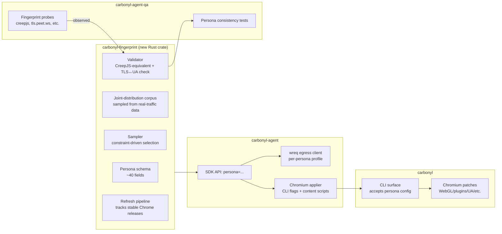

# Fingerprint Registry — Design Document

## Purpose

An **owned, coherent fingerprint management system** shared across `carbonyl`, `carbonyl-agent`, and `carbonyl-fleet`. Replaces the earlier "Phase 3 deferred TLS impersonation" framing with an affirmative architecture where every outbound network signal, every JS-observable surface, and every behavioural parameter is sourced from a single registry and must pass a consistency check before use.

Scope: this document specifies the component boundaries, data model, APIs, and validation rules. Detailed workstreams live in `05-phase-plan.md` Phase 3.

## 1. Why a registry, not a proxy

Earlier drafts of the plan framed Layer 5 as "deferred TLS impersonation via a uTLS proxy." Research (`06-research-index.md` R7–R9) pushed the framing harder in two directions:

- **A persona is a bundle, not a single field.** TLS JA4, HTTP/2 Akamai fingerprint, UA-CH full set, WebGL vendor/renderer, canvas seed, audio seed, fonts, screen dims, timezone, locale — these must all agree. A Chrome-147-on-Windows JA4 paired with a Linux UA-CH or macOS fonts is *more* suspicious than stock Chromium, because it's internally inconsistent. CreepJS exists specifically to detect that.
- **A persona must be sampled from joint distributions.** Independent sampling (WindMouse random, plus random UA, plus random WebGL) produces statistically impossible combinations (e.g. Linux + Safari UA + ANGLE/Intel renderer). BrowserForge — the corpus backing Camoufox — samples coherent joint tuples from real-traffic data. Anything less leaks consistency tells.

These findings make "inject a TLS proxy" the wrong primitive. The right primitive is a **persona** — a frozen bundle of all fingerprintable signals that gets generated together, validated together, and applied together across Chromium and any side-band HTTP the agent makes.

## 2. Component boundaries



The fingerprint crate is the single source of truth. Its consumers:

- `carbonyl-agent` SDK — selects a persona, applies it to Carbonyl (via flags) and to its own egress (via wreq)
- `carbonyl` — accepts persona-derived flags at startup; Chromium patches and content scripts consume them
- `carbonyl-agent-qa` — validates observed fingerprints match declared persona

## 3. Persona schema

Frozen bundle, serialized as TOML/YAML + Rust struct. All fields required unless marked optional.

```yaml
persona:
  id: "persona-ghost-01"                      # stable identifier
  generator_version: "2026.04.18"             # which registry version produced this
  chrome_version: "147.0.7727.94"             # governs JA4, UA-CH, H2 settings
  chrome_channel: "stable"                    # stable|beta|dev (locked to stable for agent personas)

  # Platform
  platform:
    os_family: "Linux"                        # Linux|macOS|Windows — for MVP, Linux only to match Carbonyl
    os_version: "Ubuntu 24.04"                # purely for UA-CH; doesn't affect runtime
    arch: "x86_64"
    bitness: "64"

  # User-Agent + Client Hints (all must match Chrome version + OS)
  user_agent:
    full: "Mozilla/5.0 (X11; Linux x86_64) AppleWebKit/537.36 (KHTML, like Gecko) Chrome/147.0.7727.94 Safari/537.36"
    ua_ch:
      brands: [["Chromium", "147"], ["Not_A Brand", "8"], ["Google Chrome", "147"]]
      full_version_list: [...]
      mobile: false
      platform: "Linux"
      platform_version: "6.8.0"
      model: ""
      architecture: "x86"
      bitness: "64"
      wow64: false

  # Locale + timezone (must match geo if IP binding is opinionated)
  locale:
    accept_language: "en-US,en;q=0.9"
    timezone: "America/New_York"              # must match navigator.language and any declared geo
    languages: ["en-US", "en"]

  # Screen + hardware
  device:
    screen_width: 1920
    screen_height: 1080
    color_depth: 24
    device_pixel_ratio: 1.0
    hardware_concurrency: 8                   # common Chrome caps at 8 even on higher-core machines
    device_memory: 8                          # GB; Chrome caps at 8
    max_touch_points: 0

  # WebGL (must match platform: llvmpipe = headless tell)
  webgl:
    vendor: "Google Inc. (Intel)"
    renderer: "ANGLE (Intel, Mesa Intel(R) UHD Graphics (ADL GT2), OpenGL 4.6)"
    vendor_unmasked: "Intel Inc."
    renderer_unmasked: "Intel(R) UHD Graphics"

  # Canvas + Audio noise seeds (per-persona deterministic noise; not static)
  canvas:
    noise_seed: 0x7f3a2d1e
  audio:
    noise_seed: 0x2b8c9f05

  # Fonts (installable-font enumeration)
  fonts:
    available: [Arial, Courier New, DejaVu Sans, ...]

  # Plugins (must match stock Chrome)
  plugins:
    - name: "PDF Viewer"
      filename: "internal-pdf-viewer"
    - name: "Chrome PDF Plugin"
      # ... etc.

  # Network fingerprints (emitted by egress client, must match chrome_version)
  network:
    ja4: "t13d1516h2_8daaf6152771_02713d6af862"   # full JA4 string
    ja4h_template: "po11nn12enus"                  # computed per-request actually, template here
    http2_akamai: "1:65536,2:0,3:1000,4:6291456,6:262144|15663105|0|m,a,s,p"
    alpn: ["h2", "http/1.1"]
    http3_enabled: false                       # MVP: disabled; avoid QUIC fingerprint until Phase 3E

  # Behavioural (links to persona field in humanization layer)
  behavior:
    typing_persona: "fast_typist"              # references carbonyl-agent humanization registry
    mouse_persona: "desk_mouse_windmouse"

  # Profile lifecycle
  profile:
    user_data_dir: "~/.config/carbonyl-agent/profiles/persona-ghost-01/"
    age_hours: 168                             # how warm; generator sets minimum
    sites_warmed: ["https://www.google.com", ...]  # list of pre-visited sites
```

## 4. Sampler

Given constraints (e.g. "Chrome 147, Linux, English-speaking, desktop"), the sampler:

1. Loads the joint-distribution corpus (BrowserForge-style, real-traffic-derived)
2. Filters the corpus to rows matching constraints
3. Samples one row according to the natural distribution
4. Expands into a full `Persona` struct
5. Generates derived fields (noise seeds, profile dir path) via seeded PRNG keyed by persona id

**Corpus provenance**: initially bootstrap from BrowserForge's public corpus (MIT-licensed). Long-term, maintain our own corpus derived from consented telemetry; never from scraped victim traffic.

**Refresh cadence**: on every stable Chrome release (~4 weeks). Refresh CI pulls the new Chrome JA4, UA-CH full version list, and any H2 setting changes; produces a new corpus version; existing personas retained for backwards compatibility but marked "stale" after one Chrome major.

## 5. Validator

Every persona must pass validation before the registry emits it. Checks:

- **UA ↔ UA-CH consistency**: string fields match structured fields
- **Chrome version ↔ JA4 match**: consult per-version JA4 reference table (maintained in CI)
- **Chrome version ↔ H2 Akamai fingerprint match**: per-version reference table
- **OS ↔ WebGL renderer plausibility**: Linux personas should not report ANGLE/DirectX renderers
- **OS ↔ fonts plausibility**: Linux fonts differ from macOS fonts differ from Windows fonts
- **Locale ↔ timezone plausibility**: en-US + America/New_York OK; en-US + Asia/Tokyo suspicious
- **Screen resolution commonality**: 1920×1080 common, 3141×2718 suspicious
- **hardware_concurrency bounded**: Chrome caps at 8 regardless of actual CPU

Validator runs at three points:
1. **On persona generation** — gate
2. **On persona load from storage** — gate (catches corpus drift)
3. **Observed-fingerprint validation** — runtime check after applying a persona, `carbonyl-agent-qa` probes the running browser and asserts observed fingerprint matches declared persona

## 6. Application

### 6.1 To Carbonyl/Chromium

Derived flags and content scripts:

- `--user-agent=<persona.user_agent.full>`
- `--lang=<persona.locale.accept_language>`
- `--force-device-scale-factor=<persona.device.device_pixel_ratio>`
- Content script (injected pre-navigation):
  - `navigator.userAgentData` override with persona's UA-CH
  - `navigator.hardwareConcurrency`, `deviceMemory`, `platform`, `languages` overrides
  - `Intl.DateTimeFormat().resolvedOptions().timeZone` via `TZ=...` env var
  - Canvas `toDataURL` hook applying persona-seeded noise
  - AudioContext frequency-data hook applying persona-seeded noise
- Chromium patches (Phase 2 workstreams; now consume persona values):
  - WebGL `UNMASKED_VENDOR/RENDERER_WEBGL` → persona.webgl.*
  - `navigator.plugins` → persona.plugins
  - `Notification.permission` default → "default" regardless of persona

### 6.2 To carbonyl-agent egress (wreq)

```rust
// Cargo.toml pins to roctinam/wreq on Gitea (primary):
//   wreq = { git = "https://git.integrolabs.net/roctinam/wreq",
//            tag = "v6.0.0-rc.28-carbonyl.1" }
// External consumers unable to reach Gitea may use the GitHub mirror
// (github.com/jmagly/wreq) as a fallback URL.
let persona = registry.load("persona-ghost-01")?;
let client = wreq::Client::builder()
    .impersonate(persona.network.chrome_profile())  // wreq-util profile
    .user_agent(&persona.user_agent.full)
    .accept_language(&persona.locale.accept_language)
    .build()?;
// client's outbound JA4 and H2 Akamai match persona.network.*
```

All Python-side HTTP from `carbonyl-agent` routes through this client. Any request that cannot (e.g. third-party library with its own HTTP stack) is flagged in the SDK for audit.

### 6.3 To humanization

Behavioural persona (typing style, mouse persona) selected from a parallel registry in carbonyl-agent; keyed off persona.behavior fields. Same registry conceptually, different data; may share validation infrastructure.

## 7. Library choice — revisited

Per `06-research-index.md` R7:

**Egress library: `roctinam/wreq` on Gitea (primary), mirrored to `jmagly/wreq` on GitHub** — fork of `0x676e67/wreq`. Pure Rust, reqwest-shaped, Chrome 100–146 profiles via `wreq-util`, BoringSSL backend.

Remote convention (Gitea primary; matches the rest of the ecosystem):
- `origin` → `git.integrolabs.net/roctinam/wreq` — pushes land here first; all CI runs here
- `github` → `github.com/jmagly/wreq` — publish mirror, one-way from Gitea
- `upstream` → `github.com/0x676e67/wreq` — fetch-only; source for rebases

Upstream is pre-1.0 (6.0.0-rc) and solo-maintained; operating the fork gives us pin-to-commit stability, local-patch capacity, and CVE response autonomy. Upstream rebase on quarterly cadence (or on-demand for CVEs). See `09-ci-plan.md` for the fork lifecycle policy.

**Fallback: `tls-client` (Go, via C shared lib)** if HTTP/3 support becomes necessary before wreq adds it. Adds cgo runtime weight; preferred to stay pure-Rust.

**Do not use:**
- `curl-impersonate` (lwthiker) — dead since 2024
- `uTLS` directly — Go, no Rust integration without cgo
- mitmproxy addons — no maintained Chrome-impersonating addon

**Future escape hatch: `cloudflare/boring`** — raw BoringSSL bindings. Use if we decide to own ClientHello definitions ourselves rather than track an upstream library. Requires maintaining per-Chrome-version ClientHello specs in-house.

## 8. HTTP/2 fidelity problem

Per R8: Rust's `h2` crate does not expose SETTINGS order, GREASE, or pseudo-header order. This means even wreq's `impersonate()` relies on custom H2 code (which it has). Implication for the registry design:

- We cannot mix-and-match a JA4 from wreq's profile with custom H2 settings — wreq owns both layers
- If we want non-Chrome H2 fingerprints (e.g. for a hypothetical Firefox persona), we depend on wreq adding Firefox profiles; currently Chrome-focused
- For MVP: Chrome-only personas. Firefox personas deferred.

## 9. Refresh pipeline

When Chrome 148 stable releases:

1. CI job detects new Chrome release from the omahaproxy API or equivalent
2. Captures reference JA4, UA-CH, H2 Akamai fingerprint against `tls.peet.ws` equivalent
3. Updates corpus version with new Chrome 148 tuples
4. Re-runs validator on all in-registry personas; marks Chrome 147 personas "stale-1-major"
5. Files a carbonyl-agent issue if `wreq-util` hasn't shipped Chrome 148 profile yet (bus-factor monitor)

Operator can lock a persona to a specific Chrome version to avoid auto-aging (useful for long-lived personas accumulating session reputation).

## 10. Consistency testing

carbonyl-agent-qa owns the per-persona validation harness:

- For each persona, spawn Carbonyl+agent with that persona applied
- Drive to `tls.peet.ws` — capture observed JA4; assert matches persona.network.ja4
- Drive to `browserleaks.com/javascript` + `creepjs` — capture observed JS fingerprint; assert matches persona fields
- Drive to `http2.pro` or equivalent — capture H2 Akamai fingerprint; assert matches persona.network.http2_akamai
- Report pass/fail per persona per layer; nightly regression

If observed ≠ declared, either:
- Our applier is incomplete (bug) → fix
- Chromium changed something we can't control → update corpus, mark field "uncontrollable", downgrade coverage claim

## 11. Non-goals

- **Scraped/stolen personas from real users** — corpus is BrowserForge public + consented telemetry only
- **Perfect per-Chrome-version fidelity on every field** — accept gaps, document them, don't pretend
- **Mobile personas** — desktop only for MVP
- **Firefox personas** — Chrome only until wreq (or equivalent) gains multi-browser profile support
- **Arbitrary-IP-geo matching** — IP/ASN is operator concern; registry validates declared locale/timezone but doesn't verify against outbound IP

## 12. Risks

| Risk | Mitigation |
|------|-----------|
| upstream wreq maintainer burnout (solo) | We operate `jmagly/wreq` fork; can self-maintain indefinitely. Migration plan to tls-client cgo documented in ADR-005 if the fork-maintenance burden itself becomes unsustainable |
| CVE in BoringSSL or h2 upstream of wreq | Daily `security-scan.yml` on the fork; SLA 72h cherry-pick to `carbonyl/carbonyl` branch + tag |
| Chromium stock fingerprint diverges from personas we declare | Either patch Chromium's BoringSSL (Phase 3E, deferred) or accept Carbonyl-version as the declared version, drop personas to match |
| Corpus staleness | Auto-refresh CI; alert on >1 major Chrome release without corpus update |
| CreepJS updates its detection faster than our validator | Validator is a gate, not a guarantee; QA harness is the ground truth |
| Persona consistency bugs bite silently | Observed-fingerprint validation in CI every night, per persona |

## 13. Open questions

- **Corpus size**: BrowserForge public corpus size, coverage of Linux-specific tuples. If sparse, we may need to synthesize Linux personas; document any synthesis as a consistency-risk flag on those personas.
- **wreq long-term**: if wreq stalls, what's the migration path — cgo-to-tls-client or own-ClientHello-on-boring? ADR-006 if the question becomes acute.
- **Persona seeding for determinism**: when running automated tests, do we want bit-exact reproducibility of canvas/audio noise? Probably yes for CI; seed from persona id + fixed salt.

## 14. Integration with existing workstreams

- **Phase 2A (fingerprint patches)** consumes persona values rather than hardcoded constants. WebGL spoof patch takes persona.webgl.*; plugin patch takes persona.plugins; etc.
- **Phase 2B (humanization)** persona config becomes a field inside the main persona, not a separate concept. Behavioral persona selection is keyed by main persona id.
- **Phase 1 profile management** (W1.4) becomes the storage layer for persona-bound user-data-dirs.

## 15. Deliverables

New workstreams in Phase 3 (see `05-phase-plan.md` Phase 3 section, revised):

- **W3A.1** `carbonyl-fingerprint` crate foundation — schema + registry CRUD
- **W3A.2** Joint-distribution corpus + sampler (BrowserForge integration)
- **W3A.3** Validator (all rules in §5)
- **W3A.4** Refresh pipeline (detect stable Chrome, update corpus)
- **W3B.1** `wreq` integration in `carbonyl-agent` Python SDK as internal egress
- **W3B.2** Persona → `wreq` profile binding
- **W3C.1** Persona → Chromium applier (flags + content scripts)
- **W3C.2** Measurement: stock Carbonyl JA4 vs current stable Chrome, audited quarterly
- **W3D.1** Per-persona consistency test harness in `carbonyl-agent-qa`
- **W3D.2** Nightly observed-fingerprint regression

Phase 3E (deferred sub-phase, not in scope unless needed):
- BoringSSL patch for Carbonyl's Chromium so Chromium-emitted traffic also matches persona declarations rather than Chromium's stock-of-the-day fingerprint
