# Roadmap — Trusted Automation Initiative

Consolidated executive view. Phase details live in `05-phase-plan.md`; fingerprint-registry design in `07-fingerprint-registry-design.md`; CI plan in `09-ci-plan.md`.

## One-page visual

```mermaid
gantt
    title Trusted Automation — Phase dependencies (not wall-clock)
    dateFormat X
    axisFormat %s

    section Phase 0
    Validation spike                 :p0, 0, 1

    section Phase 1
    W1.1 Chromium evdev wire (carbonyl #57)       :w11, after p0, 2
    W1.2 Rust uinput emitter (carbonyl #59)       :w12, after p0, 2
    W1.3 SDK backend-switch (agent #33)           :w13, after w12, 1
    W1.4 Durable profiles (agent #33)             :w14, after p0, 2
    W1.5 Layer 1 QA harness (agent-qa #1)         :w15, after w13, 1
    Phase 1 gate                                  :milestone, g1, after w15, 0

    section Phase 2 — parallel subtracks
    2A Fingerprint patches (×5 parallel, carbonyl) :w2a, after g1, 3
    2B Humanization (×6, carbonyl-agent)           :w2b, after g1, 3
    2A/2B QA harnesses                             :w2qa, after g1, 3
    Phase 2 gate                                   :milestone, g2, after w2a, 0

    section Phase 3 — fingerprint registry
    3A Registry foundation (agent #34)             :w3a, after g1, 3
    3B wreq egress (agent #34)                     :w3b, after w3a, 1
    3C Persona→Chromium applier                    :w3c, after g2, 2
    3D Consistency harness (agent-qa)              :w3d, after w3c, 1
    Phase 3 gate                                   :milestone, g3, after w3d, 0

    section Phase 4 — fleet
    4.* Fleet integration (carbonyl-fleet)         :w4, after g1, 4

    section Phase 3E — deferred
    3E BoringSSL patching (trigger-gated)          :w3e, after g3, 2
```



> **Dates are placeholders** — Gantt is drawn in arbitrary units to show ordering. No wall-clock estimates per `no-time-estimates` rule. Pass counts are one row per workstream; bars are dependency ordering only.

## Phase summary table

| Phase | Shape | Primary repo(s) | Gate exit criterion | State |
|-------|-------|------------------|---------------------|-------|
| **0** | 6 workstreams (W0.a host sanity, W0.1 patch audit, W0.2 build, W0.3 container, W0.4+5 harness, W0.6 text parity) | carbonyl + agent + agent-qa | Carbonyl `ozone_platform=x11` build retains rendering + uinput→Xorg→Blink `isTrusted: true` in container + `scrot` capture + text parity | W0.a + W0.1 ✅; W0.2–W0.6 pending; tracker `#60` |
| **1** | 5 workstreams, partial parallel | carbonyl + carbonyl-agent + carbonyl-agent-qa | x.com login advances past username on warmed profile in container | Tickets filed (#57 rescoped, #59 closed, agent #33, qa #1) |
| **2** | Two parallel subtracks (2A fingerprint × 5, 2B humanization × 6) | carbonyl + carbonyl-agent + carbonyl-agent-qa | Turnstile + DataDome demo ≥90% pass on 100 fresh sessions | Filed at Phase 1 close |
| **3** | Registry + egress + applier + QA | carbonyl-agent (primary) + carbonyl-agent-qa | Every persona: observed = declared on JA4 + JA4H + H2 + CreepJS | Filed (agent #34); ADR-005 pending |
| **3E** | Trigger-gated; BoringSSL patching | carbonyl | Only if drift audit justifies | Deferred |
| **4** | Fleet integration, uinput namespacing | carbonyl-fleet | N=10 concurrent instances pass per-instance QA | Filed at Phase 1 close |

## Decision points (ADR sign-offs required)

| ADR | Subject | Required by | Status |
|-----|---------|-------------|--------|
| **002** | Trusted input approach — evdev+uinput over CDP | Phase 0 close | Pending (post-spike) |
| **003** | Humanization location — carbonyl-agent Rust generation + Python policy | Phase 2 open | Pending |
| **004** | Fingerprint mitigation priority — flag > content-script > Chromium patch | Phase 2 open | Pending |
| **005** | Fingerprint registry library — `jmagly/wreq` primary, `tls-client` fallback | Phase 3 open | Pending |
| **006** | BoringSSL patch strategy — conditional on 3E activation | Phase 3E open only | Conditional |

## Repo × phase matrix

| | Phase 0 | Phase 1 | Phase 2 | Phase 3 | Phase 3E | Phase 4 |
|--|---------|---------|---------|---------|----------|---------|
| **carbonyl** | spike | ✓ core | ✓ patches (2A) | light (W3C.3 rewire) | ✓ (if activated) | consumer |
| **carbonyl-agent** | | ✓ | ✓ humanization (2B) + applier | **✓ primary** | | consumer |
| **carbonyl-agent-qa** | | ✓ | ✓ | ✓ | | ✓ |
| **carbonyl-fleet** | | | | | | **✓ primary** |

## Critical path

Shortest viable path to credible automation on a reference site (x.com login):

```
Phase 0 spike
  → W1.1 (Chromium evdev wire) + W1.2 (Rust uinput) [parallel]
  → W1.3 (SDK backend-switch) + W1.4 (profile persistence) [parallel]
  → Phase 1 gate
  → Phase 2A.1 (remove UA suffix) + 2B.2 (keystroke scheduler) + 2B.3 (mouse motion) [parallel, MVP subset]
  → Phase 3A (registry foundation) + 3B (wreq egress) [early start possible]
  → First end-to-end x.com login with trusted, humanized, persona-coherent agent
```

Phase 2 full corpus (all fingerprint patches, all humanization refinement) and Phase 3 full rollout (all 4 sub-phases) complete the hardening; critical-path MVP is a subset.

## Dependencies on upstream

| Upstream | We depend on | Risk | Mitigation |
|----------|--------------|------|------------|
| Chromium upstream | Every major version bump rebases patches | High — ongoing tax | Keep patch count minimal; prefer flags + content scripts |
| `roctinam/wreq` (Gitea, our fork of `0x676e67/wreq`) | Chrome-profile coverage, BoringSSL currency, post-quantum TLS | Medium — solo upstream, we now own the fork | Sync cadence policy (see §CI below); self-maintain if upstream stalls; GitHub mirror at `jmagly/wreq` for external-consumer access |
| BrowserForge corpus | Joint-distribution persona data | Low — MIT, we can mirror | Vendor a snapshot into `carbonyl-fingerprint` crate |
| CreepJS | Fingerprint probe ground truth | Low — we consume, not depend-on-CI | Pin to known-good snapshot in QA repo |
| omahaproxy API (Chrome release detection) | Refresh pipeline trigger | Low | Fallback: scrape chromiumdash or use a polling script |

## Explicitly out of scope (reaffirmed)

- Defeating high-protection-tier Akamai (banking, airline)
- CAPTCHA solving
- Mobile or Firefox personas (MVP)
- Residential/mobile proxy infrastructure (operator/fleet concern)
- Credential theft or unauthorized impersonation

## Governance checkpoints

- **Phase gate reviews**: at each gate, produce a short written "gate report" summarising acceptance-test pass rates, open risks, next-phase readiness. One report per gate, filed under `.aiwg/reports/`.
- **Quarterly drift audit**: Phase 3C.3 measures Carbonyl-emitted JA4 against current stable Chrome. Audit report filed `.aiwg/reports/drift-audit-YYYYqQ.md`. Outcome feeds Phase 3E activation decision.
- **wreq fork sync review**: quarterly cadence (or on-demand for CVEs). Upstream changes reviewed + merged into `jmagly/wreq`; breaking changes documented; downstream pin bumped in `carbonyl-agent`.

## Critical component: `roctinam/wreq` fork (Gitea primary)

Operating the fork (not just consuming upstream) changes the Phase 3 risk profile meaningfully. Per ecosystem convention, **Gitea is primary** (`roctinam/wreq`), GitHub is publish-mirror (`jmagly/wreq`).

**Benefits gained by forking:**
- Pin-to-commit stability — no surprise breakage on `cargo update`
- Ability to carry local patches (e.g. Chrome-147-specific profile we need before upstream ships it)
- Security patch capacity if upstream is slow on a CVE
- Bus-factor mitigation — if upstream stalls, we have a living branch

**New responsibilities:**
- Sync cadence (quarterly or on-demand; documented in CI plan)
- CVE monitoring on BoringSSL upstream and upstream wreq
- Our fork must build green in CI before `carbonyl-agent` consumes a new pin
- Release tagging on the fork so `Cargo.toml` can reference stable refs

**Planned policy:**
- `roctinam/wreq` `main` tracks upstream `0x676e67/wreq` `main`, rebased not merged
- Local patches live on named branches (`carbonyl/*`) that rebase onto `main` on each sync
- `carbonyl-agent`'s `Cargo.toml` pins to a specific fork tag from Gitea (e.g. `git.integrolabs.net/roctinam/wreq` tag `v6.0.0-rc.28-carbonyl.1`), never a branch or `main`
- Gitea → GitHub one-way mirror for external-consumer access (`jmagly/wreq`)
- Sync cadence: quarterly; accelerated for CVE or Chrome major release

Full sync workflow specified in `09-ci-plan.md`.

## Where we are right now (2026-04-18)

**Done:**
- Research tracks R1–R3, R5, R7, R8, R9 with citations
- SDLC doc corpus v3 (vision, requirements, architecture, threat model, test strategy, phase plan, research index, fingerprint registry design, roadmap, CI plan)
- Epic #58 and Phase 1 + Phase 3 + CI umbrella issues filed
- wreq fork adopted; Gitea-primary mirror created (`roctinam/wreq`, Gitea #149) with GitHub publish target at `jmagly/wreq`
- Fingerprint corpus repo created (`roctinam/carbonyl-fingerprint-corpus`, private, Gitea #150) with `roctibot` as write collaborator

**Immediate next:**
- Full Phase 0 validation spike, now container-based: build Carbonyl `ozone_platform=x11`, package with Xorg+dummy/modesetting, run uinput→isTrusted test + visual capture in container (ADR-002 rev 2)
- Finalize ADR-002 rev 2 (DRAFT → APPROVED post-spike)
- Rescope #57, close #59, file replacement issues for container workstream and agent-side input module
- First pin of `jmagly/wreq` with Chrome 147 profile for corpus bootstrap

**Sanity check completed (2026-04-19, grissom)**: `python-uinput` → host Xorg → real browser on `istrusted_logger.html` delivered `isTrusted: true` events. This validates the uinput half of the pipeline and supports the architectural pivot from "patch headless Ozone" to "run Xorg-in-container".

**W0.1 patch audit completed (2026-04-20)**: All 24 Carbonyl patches target the `chromium/src/headless/` shell (Ozone-agnostic), not `ui/ozone/platform/headless/` (the backend being replaced). File-apply risk: 0/24. 5 patches carry runtime semantic risk for the rendering-bridge path — validated in W0.2. Phase 0 risk downgraded from "2–4 rebuild passes for patch triage" to "1 clean apply + 1–2 runtime triage passes". Report: `.aiwg/reports/phase0-w01-patch-audit.md` (commit `279eed2`). Closed `carbonyl#61`.

**Open questions:**
- Corpus provenance: use BrowserForge public corpus as-is, or sample our own from consented telemetry? Defer to Phase 3A kickoff
- Phase 4 (fleet) timing: start in parallel with Phase 2, or wait for Phase 3? Defer to Phase 1 close
- `jmagly/wreq` upstream sync cadence: quarterly confirmed; first sync triggered by first use
