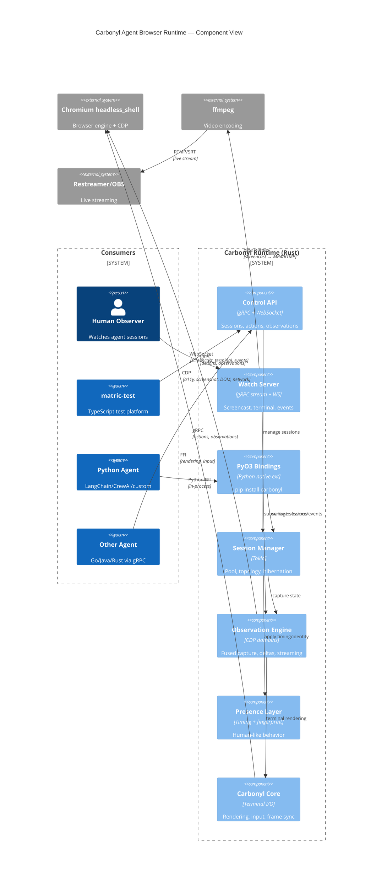
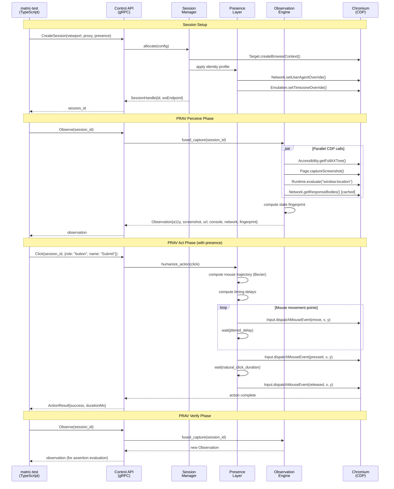
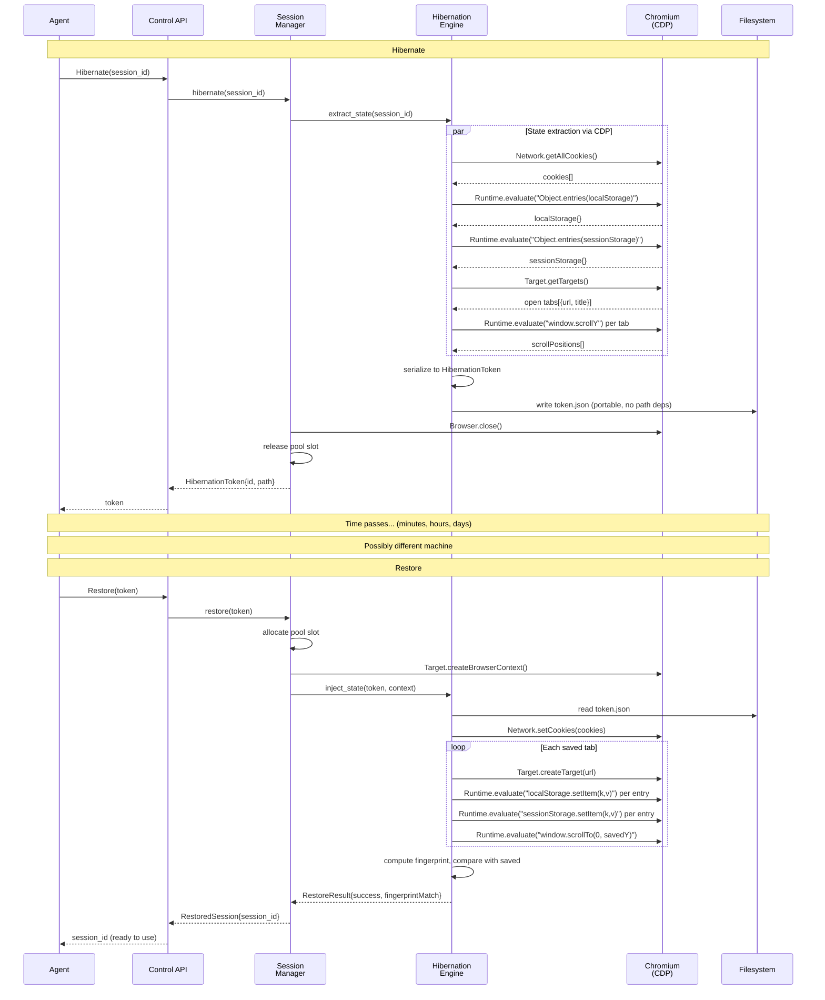
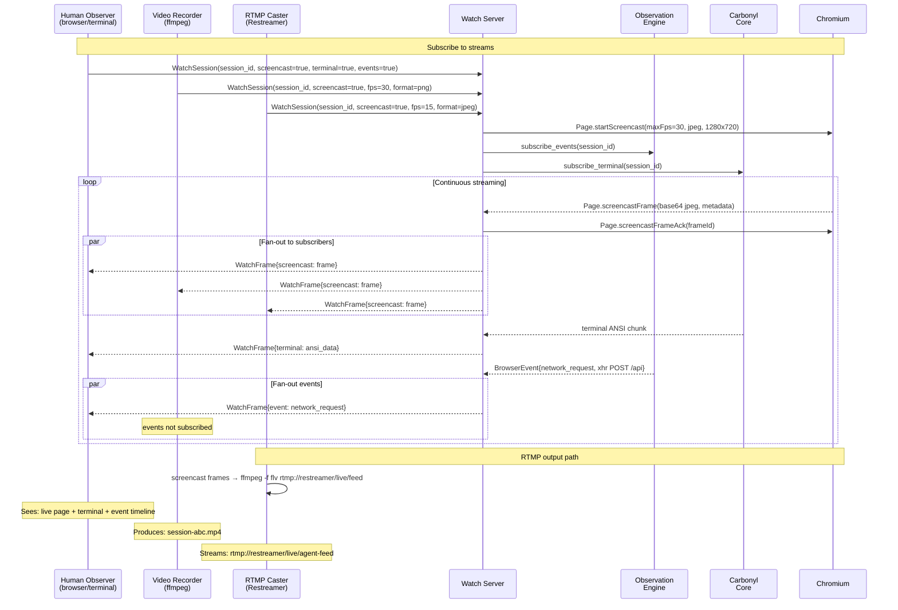
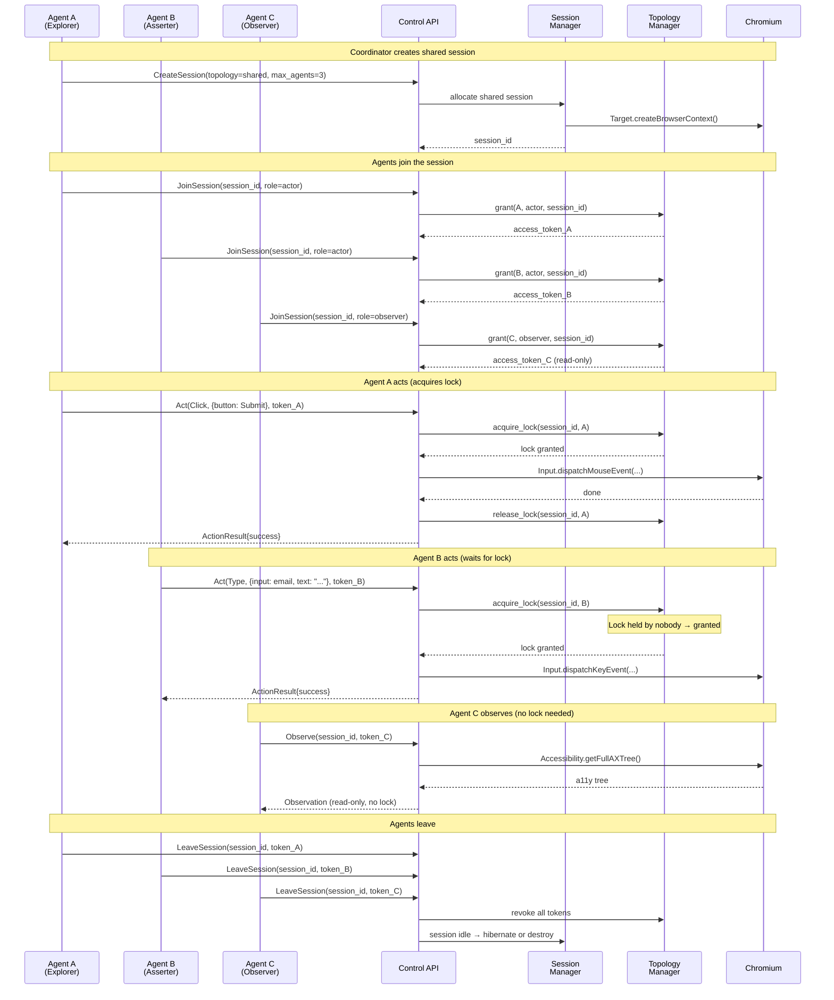
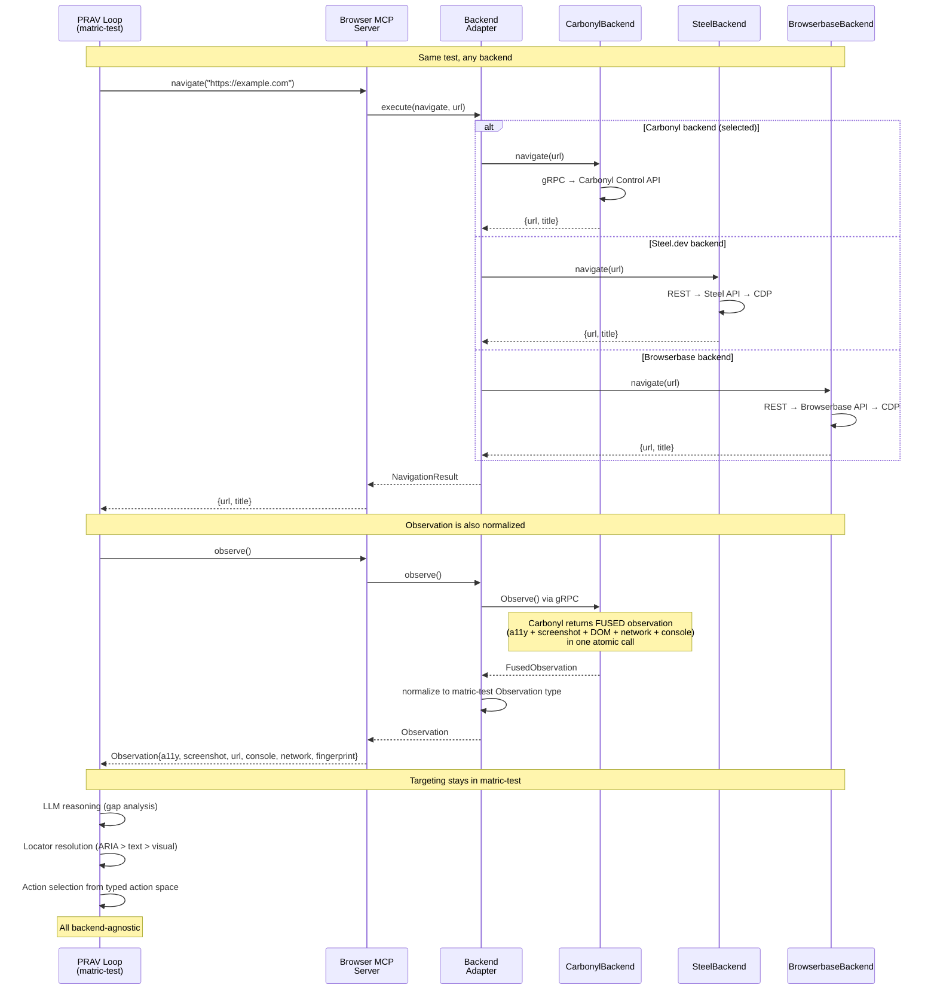

# Carbonyl Agent Browser Runtime — Architecture

## High-Level Architecture

```
                         Consumers
    ┌──────────────┬──────────────┬──────────────┬───────────────┐
    │  matric-test  │   Python     │   Go/Java    │   Dashboard   │
    │  (TypeScript) │   Agents     │   Agents     │   (Web UI)    │
    │              │              │              │               │
    │  gRPC Client │  PyO3 SDK    │  gRPC Client │  WebSocket    │
    └──────┬───────┴──────┬───────┴──────┬───────┴───────┬───────┘
           │              │              │               │
    ═══════╪══════════════╪══════════════╪═══════════════╪════════
           │              │              │               │
    ┌──────▼──────────────▼──────────────▼───────────────▼───────┐
    │                                                             │
    │                   Carbonyl Runtime (Rust)                   │
    │                                                             │
    │  ┌─────────────┐  ┌─────────────┐  ┌───────────────────┐  │
    │  │ Control API  │  │   Watch     │  │   PyO3 Bindings   │  │
    │  │ (gRPC/WS)   │  │   Server    │  │   (in-process)    │  │
    │  │             │  │  (streams)  │  │                   │  │
    │  └──────┬──────┘  └──────┬──────┘  └────────┬──────────┘  │
    │         │                │                   │             │
    │  ┌──────▼────────────────▼───────────────────▼──────────┐  │
    │  │                Session Manager                        │  │
    │  │  ┌──────────┐ ┌──────────┐ ┌───────────────────────┐ │  │
    │  │  │  Pool     │ │ Topology │ │    Hibernation        │ │  │
    │  │  │  Manager  │ │ Manager  │ │    Engine             │ │  │
    │  │  │          │ │          │ │                       │ │  │
    │  │  │ Resource  │ │ Shared/  │ │ Cookie extraction    │ │  │
    │  │  │ ceilings  │ │ isolated │ │ Storage serialization│ │  │
    │  │  │ eviction  │ │ multi-   │ │ State fingerprint    │ │  │
    │  │  │          │ │ agent    │ │ Portable tokens      │ │  │
    │  │  └──────────┘ └──────────┘ └───────────────────────┘ │  │
    │  └──────────────────────┬────────────────────────────────┘  │
    │                         │                                   │
    │  ┌──────────────────────▼────────────────────────────────┐  │
    │  │              Observation Engine                        │  │
    │  │                                                       │  │
    │  │  Fused capture (a11y + screenshot + DOM + net + cons) │  │
    │  │  Delta observations    Streaming events               │  │
    │  │  State fingerprinting  Screencast frames              │  │
    │  └──────────────────────┬────────────────────────────────┘  │
    │                         │                                   │
    │  ┌──────────────────────▼────────────────────────────────┐  │
    │  │               Presence Layer                           │  │
    │  │                                                       │  │
    │  │  Timing humanization   Identity profiles              │  │
    │  │  Mouse trajectories    Fingerprint coherence          │  │
    │  │  Keystroke jitter      Viewport/UA/TZ rotation        │  │
    │  └──────────────────────┬────────────────────────────────┘  │
    │                         │                                   │
    │  ┌──────────────────────▼────────────────────────────────┐  │
    │  │           Existing Carbonyl Core (~3,154 LOC)          │  │
    │  │                                                       │  │
    │  │  Terminal rendering    Input handling                  │  │
    │  │  Quadrant binarizer   ANSI parser                     │  │
    │  │  Frame sync (60fps)   Navigation UI                   │  │
    │  └──────────────────────┬────────────────────────────────┘  │
    │                         │ extern "C" FFI                    │
    └─────────────────────────┼───────────────────────────────────┘
                              │
    ┌─────────────────────────▼───────────────────────────────────┐
    │              Chromium headless_shell                         │
    │                                                             │
    │  Blink    Skia    V8    CDP Server    Network    GPU        │
    └─────────────────────────────────────────────────────────────┘
```

## Component Diagram



## Sequence Diagrams

### Flow 1: Agent PRAV Cycle (matric-test → Carbonyl)



### Flow 2: Session Hibernation and Restore



### Flow 3: Unified Streaming (Watch)



### Flow 4: Multi-Agent Shared Session



### Flow 5: matric-test Backend Normalization



## Component Responsibilities

| Component | Owns | Does Not Own |
|-----------|------|-------------|
| **Control API** | gRPC/WS endpoints, auth, rate limiting | Business logic — delegates to managers |
| **Watch Server** | Stream multiplexing, fan-out, backpressure | Frame generation — subscribes to sources |
| **Session Manager** | Pool, lifecycle, topology, resource ceilings | Browser internals — uses CDP |
| **Hibernation Engine** | State extraction, serialization, restoration | Cookie/storage format — uses CDP APIs |
| **Observation Engine** | Fused capture, deltas, streaming events | Element targeting — that's matric-test |
| **Presence Layer** | Timing, trajectories, fingerprints, identities | Test logic — transparent to agents |
| **Carbonyl Core** | Terminal rendering, ANSI I/O, frame sync | CDP — separate channel |
| **Chromium** | HTML/CSS/JS, rendering, networking, CDP | Everything above the CDP wire |

## Data Flow Summary

```
Agent request
  → Control API (gRPC/PyO3)
    → Session Manager (routing, access control)
      → Presence Layer (timing humanization)
        → Chromium (CDP execution)
          → Page mutation
        ← CDP events
      ← Raw observation
    ← Fused observation
  ← Typed response

Streaming (parallel):
  Chromium → Screencast frames ──→ Watch Server ──→ Observers
  Chromium → CDP events ─────────→ Watch Server ──→ Agents/Observers
  Carbonyl Core → ANSI output ──→ Watch Server ──→ Terminal viewers
  Watch Server → ffmpeg ─────────→ MP4 file / RTMP stream
```
